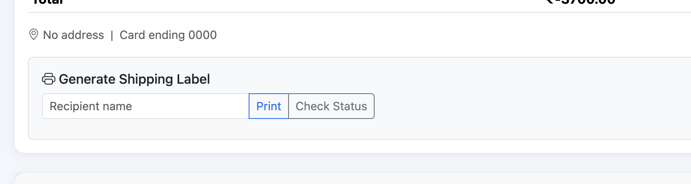
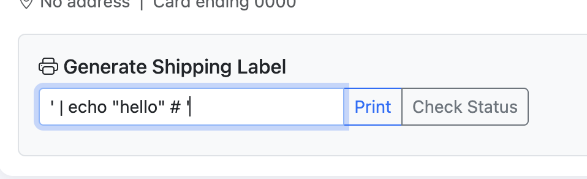
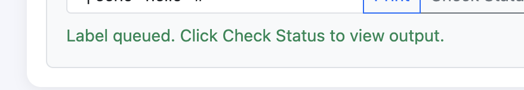
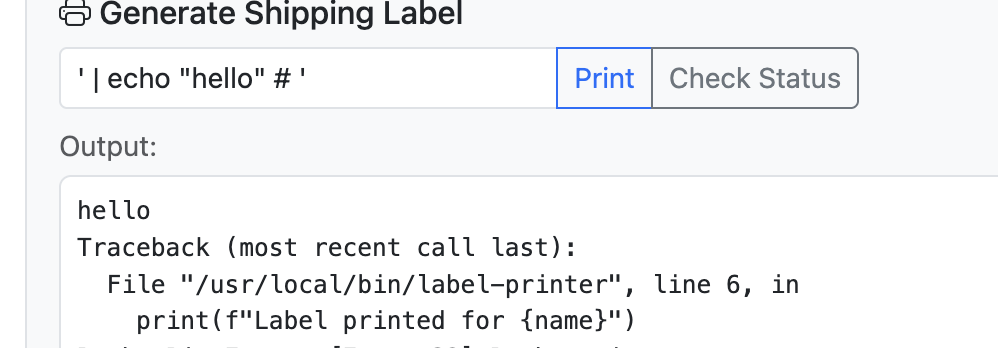

# Check Status - Command Injection

## Description

The check status feature of order status check is broken, it is vulnerable to command injection.

## Steps to Reproduce

1. Sign in
2. Create some orders
3. Go to the orders page (`/orders`)
4. Use the generate shipping label form to perform command injection
5. Write `' | <injected-command> # '` with `<injected-command>` being the command you want to execute on the server and click the print button.
6. Now click the check status button and you will see the output of the command you injected.

## Screenshots

- 
- 
- 
- 

## Impact

- Command injection
- Denial of service
- Remote code execution
- Data exfiltration
- Privilege escalation

## Remediation

- The developer should sanitize the input and use parameterized queries to prevent command injection. Additionally, they should validate and escape any user input before using it in system commands.
- Additionally, the developer should implement proper permissions on OS level to prevent unauthorized command execution and limit the potential impact of any successful injection.

# CVSS Score

```
Score: 8.8
Vector: CVSS:3.1/AV:N/AC:L/PR:L/UI:N/S:U/C:H/I:H/A:H
```

