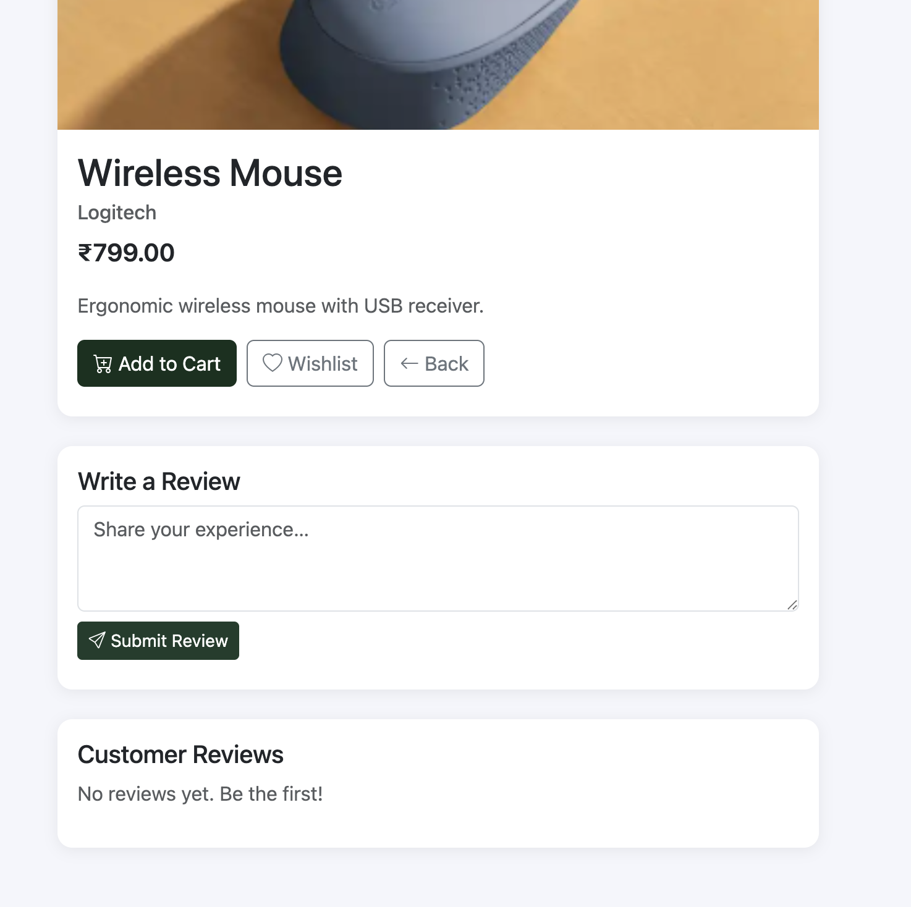
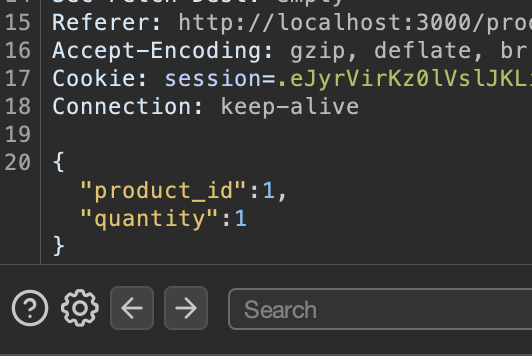
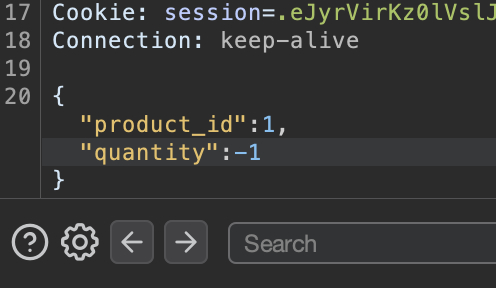
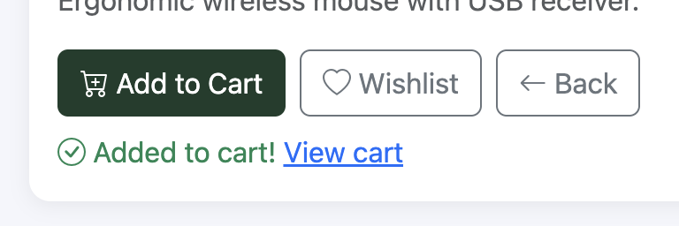
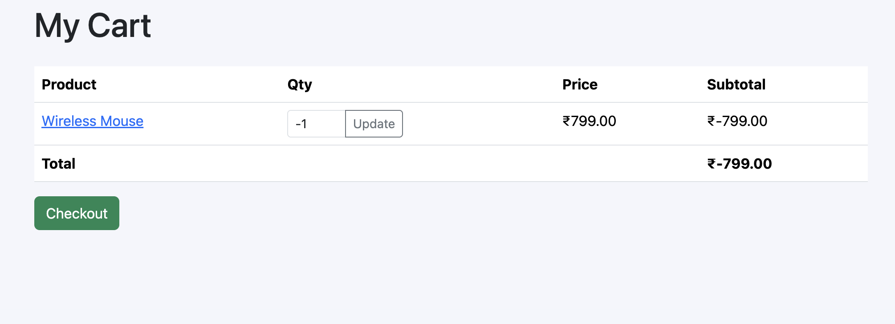
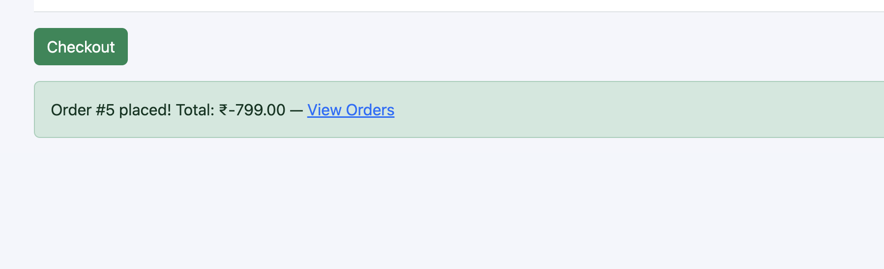

# Negative Quantity - Business Logic Vulnerability

## Description

The add quantity feature of order creation is broken, it is vulnerable to business logic vulnerability. A user can add negative quantity to an order.

## Steps to Reproduce

1. Sign in
2. Go to some product page
3. Make sure to keep the Proxy intercept on
4. Add the product to cart
5. Intercept the request
6. Change the quantity to a negative number
7. Forward the request
8. Success message will be shown
9. Verify by going to the cart
10. Negative quantity will be shown in the cart, with negative total price.
11. Order can also be placed with negative quantity

## Screenshots

- 
- 
- 
- 
- 
- 

## Impact

- Business logic vulnerability
- Financial loss
- Data integrity issues
- User trust violation

## Remediation

- The developer should implement proper validation on the server side to ensure that the quantity cannot be negative. Additionally, they should implement checks to prevent any manipulation of the request parameters.
- The developer should also implement proper logging and monitoring to detect any suspicious activities related to order creation and quantity manipulation.
- There should be additional checks before the order is placed to ensure that the total quantity is valid and does not result in negative values.

# CVSS Score

```
Score: 4.3
Vector: CVSS:3.1/AV:N/AC:L/PR:L/UI:N/S:U/C:N/I:L/A:N
```

