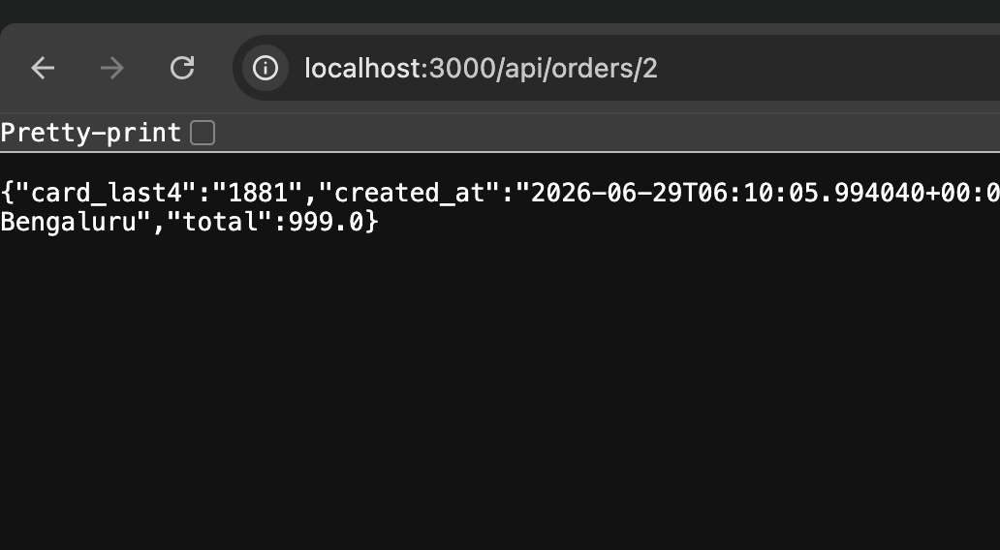

# Unauthorized Order Details - API Authorization Bypass

## Description

The API endpoint for retrieving order details is vulnerable to authorization bypass. It does check for login, however it doesn't check if the user is the correct user for the order.

## Steps to Reproduce

1. Sign in
2. Go to the individual order API endpoint (`/api/orders/<order_id>`)
3. Change the `<order_id>` to an order that belongs to another user
4. The order details are returned, even though that order belongs to another user.

## Screenshots

- 

## Impact

- Unauthorized access
- Data exfiltration
- Privacy violation
- Reputation damage

## Remediation

- The developer should implement proper authorization checks to ensure that users can only access their own order details. This can be done by verifying the user's identity against the order's owner before returning the order details.
- The developer should also implement proper logging and monitoring to detect any suspicious activities related to order access.

# CVSS Score

```
Score: 4.3
Vector: CVSS:3.1/AV:N/AC:L/PR:L/UI:N/S:U/C:L/I:N/A:N
```

