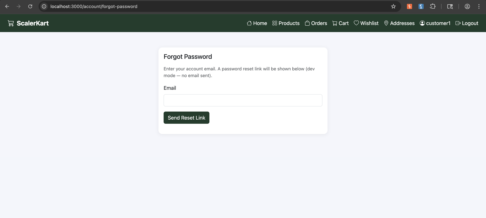
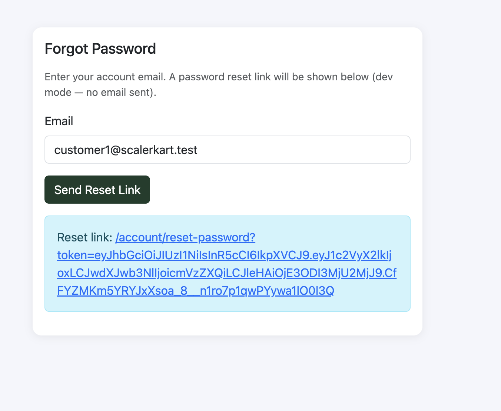
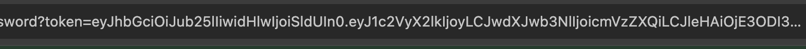
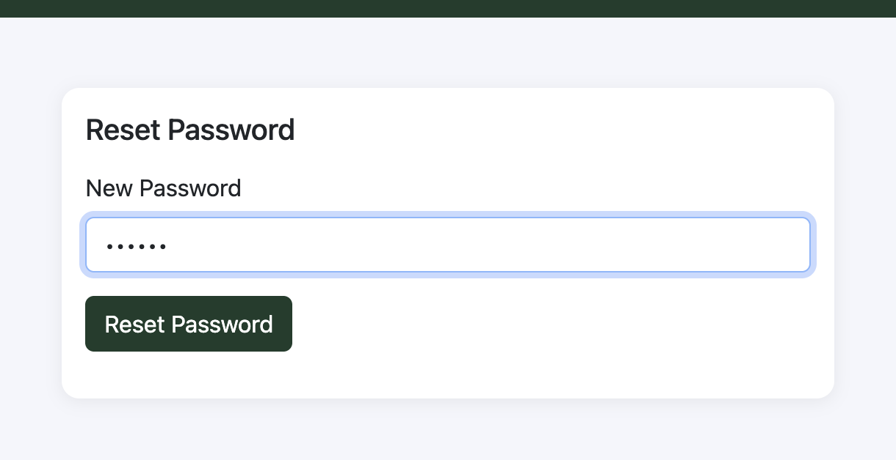
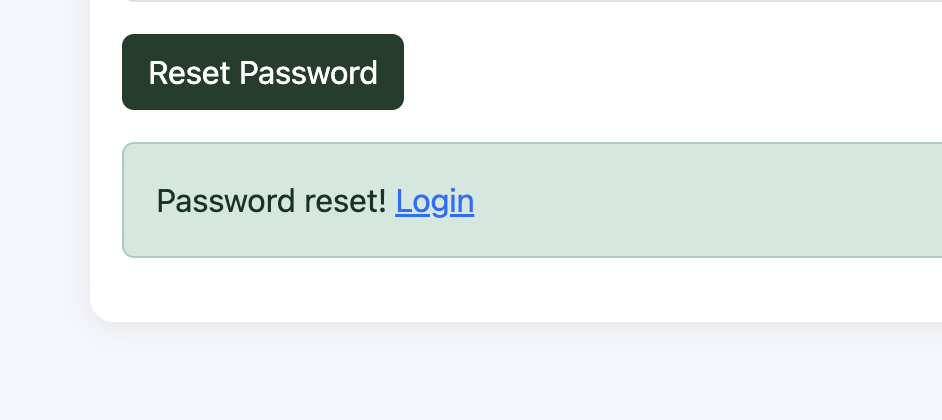

# Reset Other User Password - Unsigned JWT Attack

## Description

The password reset feature accepts a token which contains details of the user whose password is being reset. The token is a JWT signature is not verified, which allows an attacker to reset the password of by crafting a JWT with no signature and malicious payload.

## Steps to Reproduce

1. Go to Password Reset page (`/account/forgot-password`)
2. Enter any valid email address which is registered in the system
3. Password reset link will be shown on the page, copy the URL
4. The URL contains a `token` parameter, which is a JWT token.
5. Edit the token using a JWT editor
6. Change the user ID to some other user ID
7. Remove the signature from the JWT token
8. Now use the modified token in the password reset URL
9. Set the new password for the other user and submit the form
10. A success message will be shown, indicating that the password has been reset for the other user.

## Screenshots

- 
- 
- 
- 
- 

## Impact

- Unauthorized access
- Data exfiltration
- Privilege escalation
- Account takeover
- Impersonation

## Remediation

- The developer should verify the signature of the JWT token before processing the password reset request.
- Additionally, they should implement proper access controls and validation to ensure that only authorized users can reset their own passwords.

# CVSS Score

```
Score: 5.3
Vector: CVSS:3.1/AV:N/AC:L/PR:N/UI:N/S:U/C:L/I:N/A:N
```

