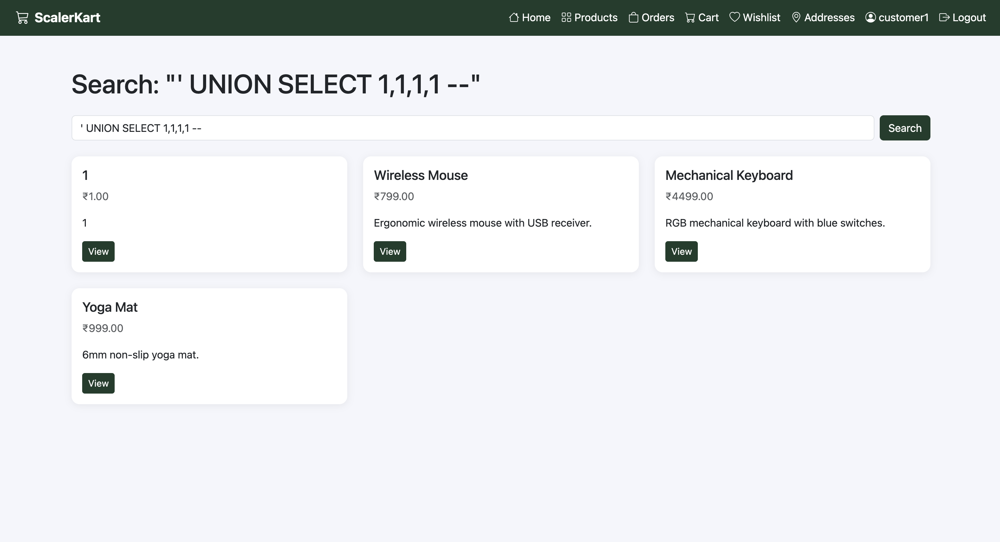
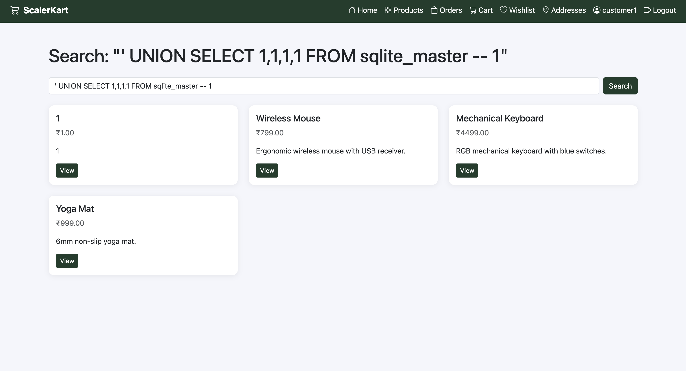
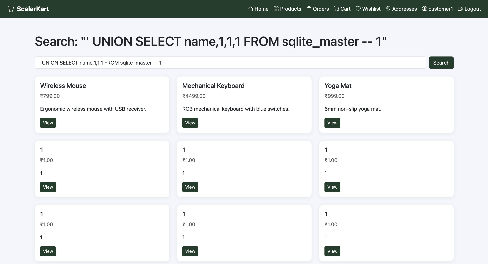
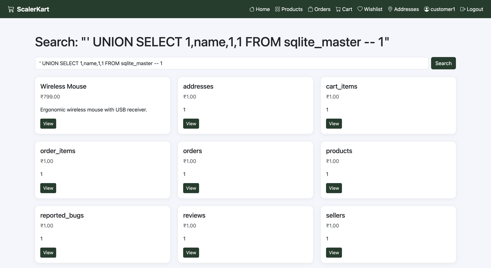
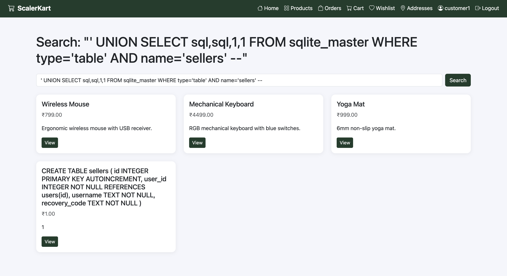
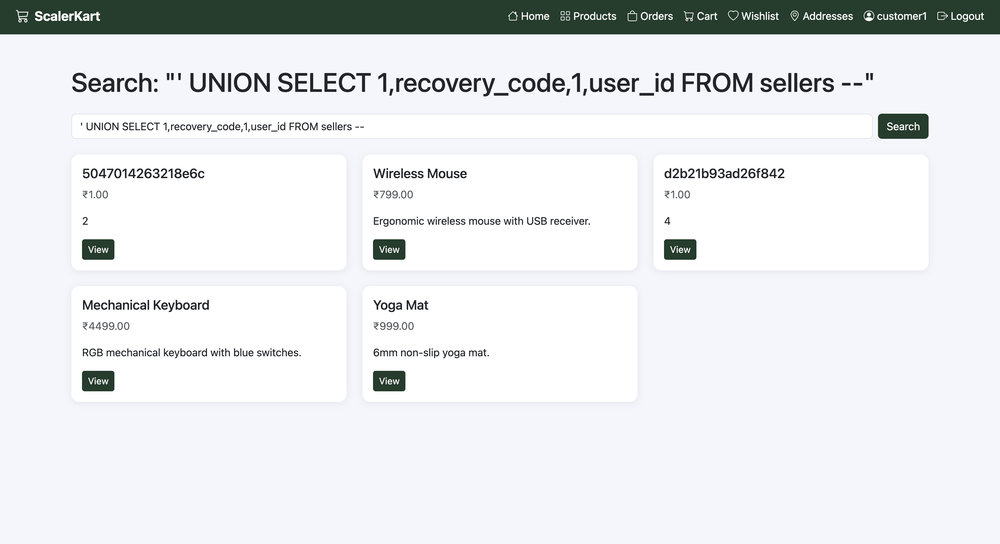

# Bad Search Queries - SQL Injection

## Description

The search feature of the application is vulnerable to SQL injection.

## Steps to Reproduce

1. Sign in
2. Go to products page (`/products`)
3. Use the search bar to search
4. Detect injection with `' OR 1=1 -- ` and click the search button.
5. Use union attack to find out the SQL type (here, SQLITE3)
6. Perform union attacks to extract data from the database

## Screenshots

- 
- 
- 
- 
- 
- 

## Impact

- SQL injection
- Data exfiltration

## Remediation

- The developer should implement proper input validation and parameterized queries to prevent SQL injection.
- Additionally, they should use prepared statements and stored procedures to further secure the application against SQL injection attacks.

# CVSS Score

```
Score: 5.3
Vector: CVSS:3.1/AV:N/AC:L/PR:N/UI:N/S:U/C:L/I:N/A:N
```

