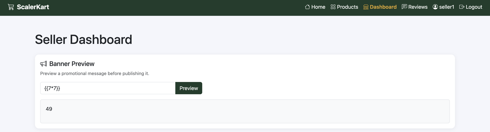
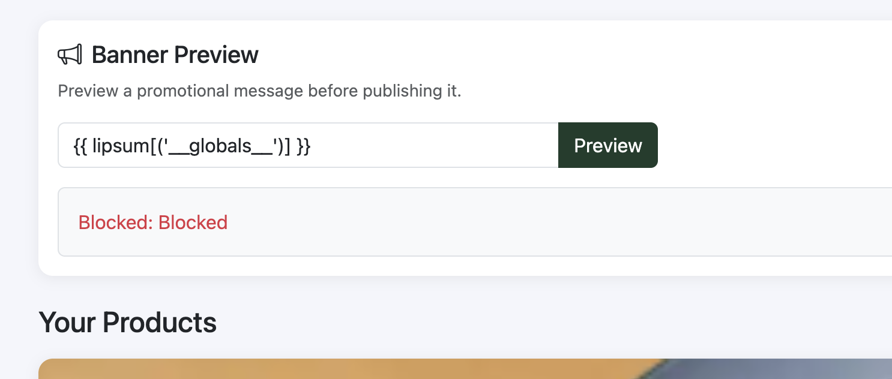
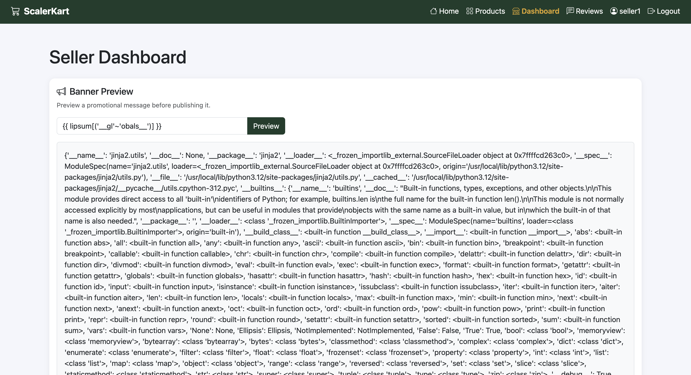
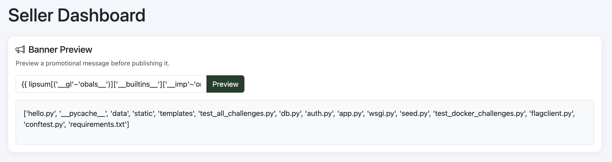
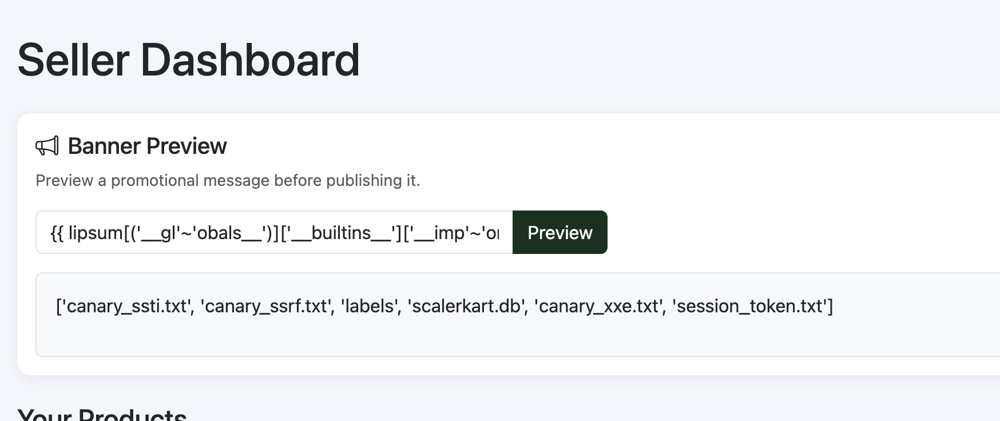
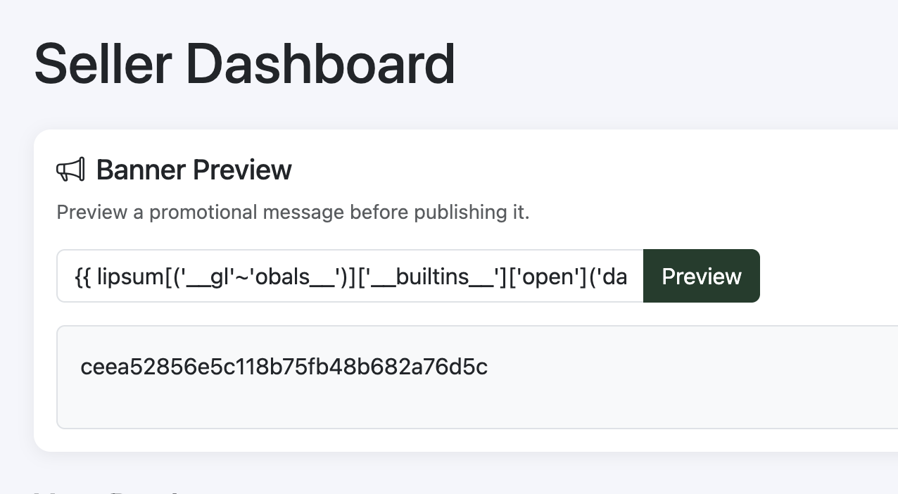

# Promo Banner Template Leakage - Server Side Template Injection

## Description

The promo banner preview feature is vulnerable to server side template injection.

## Steps to Reproduce

1. Sign in as Seller
2. Go to dashboard page (`/seller/dashboard`)
3. Use injection in the message

## Screenshots

- 
- 
- 
- 
- 
- 

## Impact

- Server Side Template Injection
- Data exfiltration
- Remote code execution

## Remediation

- The developer should implement proper input validation and sanitization to prevent server side template injection.
- Additionally, they should use a secure templating engine that automatically escapes user input and does not allow arbitrary code execution.

# CVSS Score

```
Score: 6.4
Vector: CVSS:3.1/AV:N/AC:H/PR:L/UI:N/S:U/C:H/I:L/A:L
```

