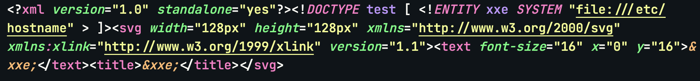
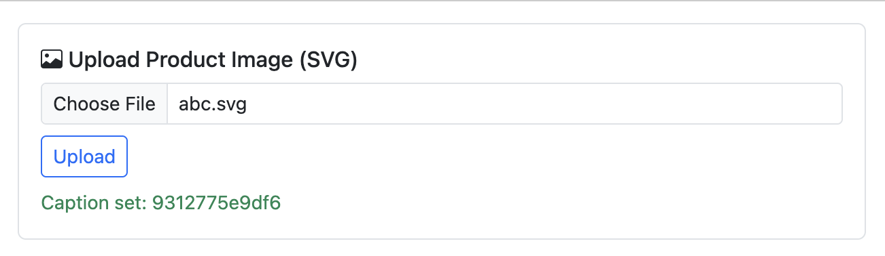

# SVG Exploit - XXE Hacking

## Description

The import image from SVG feature is vulnerable to XML External Entity (XXE) injection.

## Steps to Reproduce

1. Sign in as Seller
2. Go to dashboard page (`/seller/dashboard`)
3. Upload malicious SVG file with XXE payload to import image

> Note, the caption thing apparently needs title tag, in a normal scenario, it's mostly a chance by trying out all tags or a source code leak.

## Screenshots

- 
- 

## Impact

- XML External Entity (XXE) injection
- Data exfiltration

## Remediation

- The developer should implement proper input validation and sanitization to prevent XML External Entity (XXE) injection.
- Additionally, they should disable external entity processing in the XML parser and use a secure XML parser that does not allow external entity resolution.

# CVSS Score

```
Score: 4.3
Vector: CVSS:3.1/AV:N/AC:L/PR:L/UI:N/S:U/C:L/I:N/A:N
```

