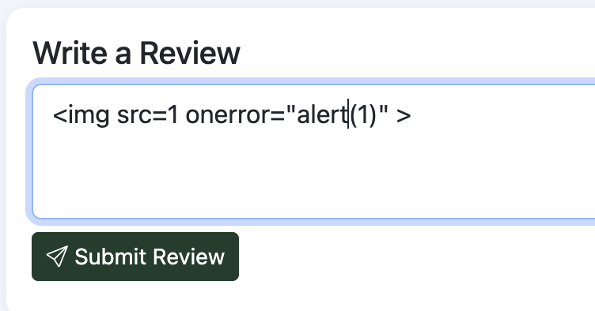
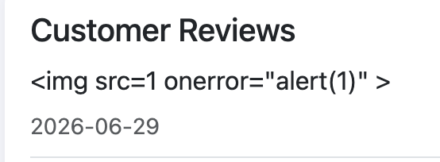
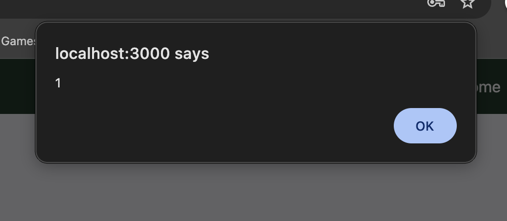

# Product Review Comment XSS - Cross-Site Scripting

## Description

The product review comment feature is vulnerable to cross-site scripting (XSS) injection.

## Steps to Reproduce

1. Sign in
2. Go to a product page
3. Submit a malicious comment with XSS payload

> Note, for this vulnerability, one should know that the seller side is not evaluating content of the comment as text but rather as HTML.

## Screenshots

- 
- 
- 
- 

## Impact

- Cross-Site Scripting (XSS) injection
- Data exfiltration

## Remediation

- The developer should implement proper input validation and sanitization to prevent Cross-Site Scripting (XSS) injection.
- Additionally, they should use output encoding to ensure that any user-generated content is properly escaped before being rendered in the browser.

# CVSS Score

```
Score: 4.3
Vector: CVSS:3.1/AV:N/AC:L/PR:L/UI:N/S:U/C:L/I:N/A:N
```

