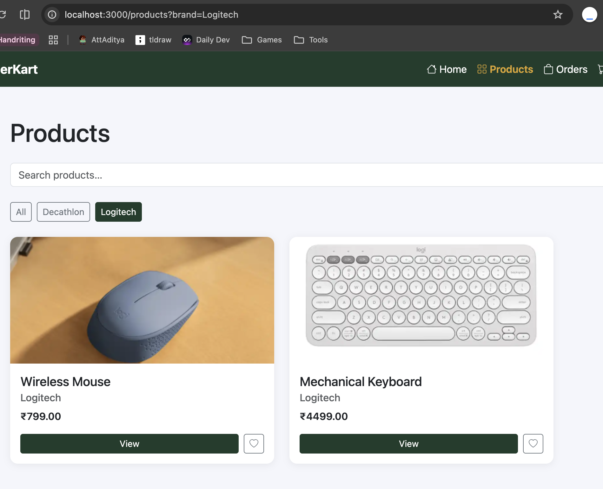
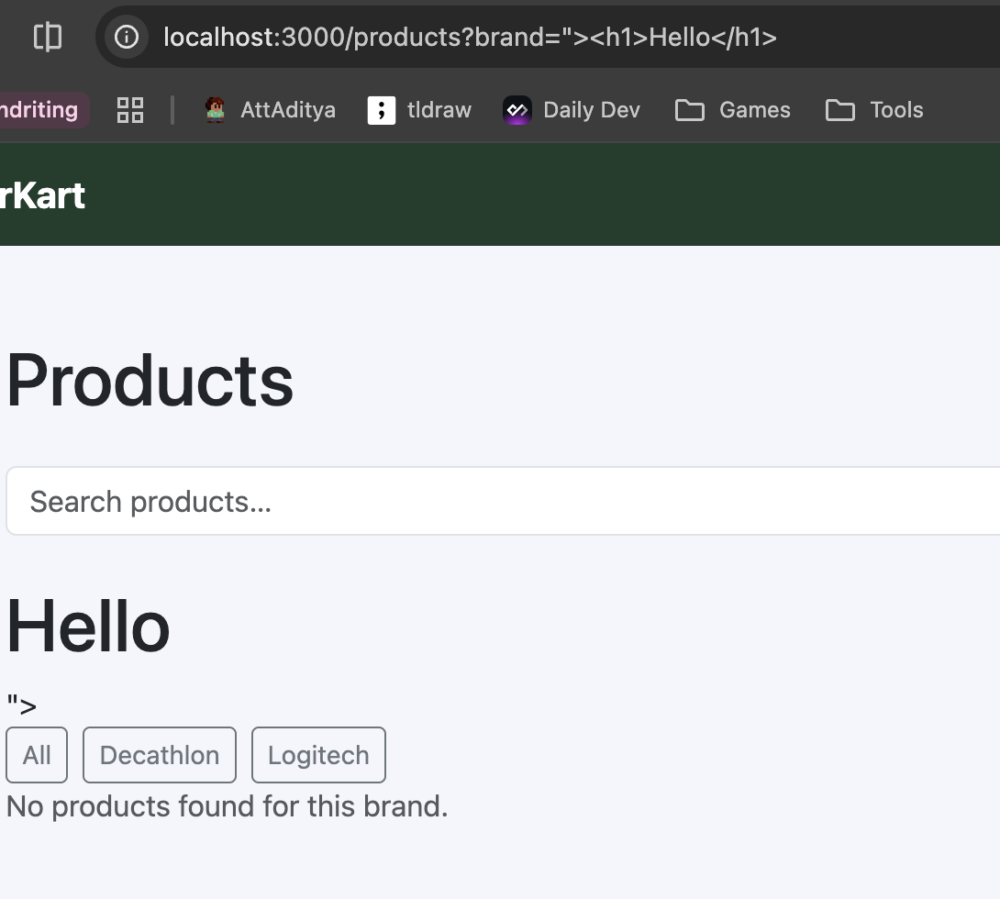
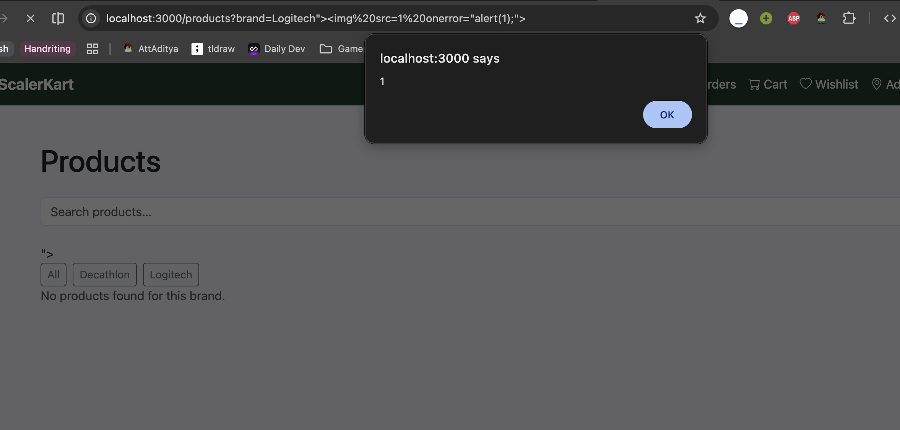

# Brand Filter Escape Exploit - Reflected XSS

## Description

The brand filter feature is vulnerable to reflected XSS attacks due to insufficient input validation and sanitization.


## Steps to Reproduce

1. Sign in
2. Go to products page (`/products`)
3. Select any brand from the brand filters
4. Update the `brand` parameter in the URL
5. URL should use `">` to break out of the attribute
6. Inject a custom payload

## Screenshots

- 
- 
- 

## Impact

- Reflected XSS
- Session Hijacking
- Phishing attacks
- Defacement of the website

## Remediation

- The developer should implement proper input validation and sanitization to prevent XSS attacks. This includes escaping special characters in user input and using secure coding practices to handle user-generated content.
- Additionally, implementing Content Security Policy (CSP) can help mitigate the impact of XSS vulnerabilities.

# CVSS Score

```
Score: 4.3
Vector: CVSS:3.1/AV:N/AC:L/PR:L/UI:N/S:U/C:L/I:N/A:N
```

