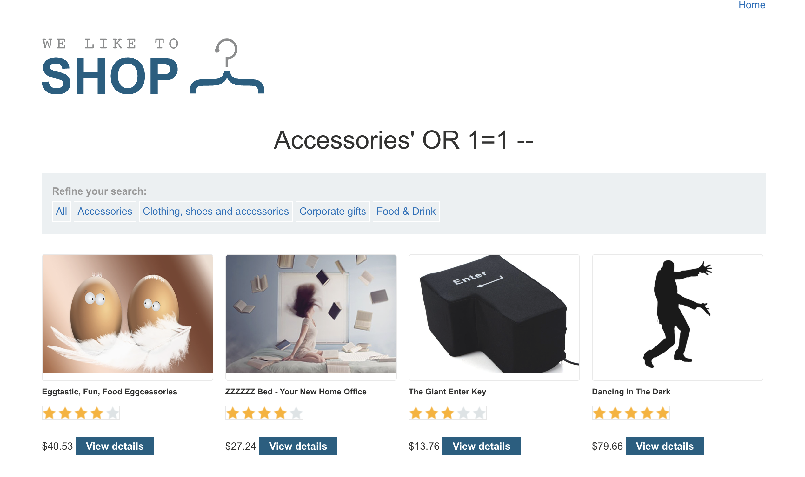

# Description

[**Lab Link**](https://portswigger.net/web-security/sql-injection/lab-retrieve-hidden-data)

**Lab**: _SQL injection vulnerability in WHERE clause allowing retrieval of hidden data_

The application has filter options, when the filter feature is used, the value of the filter is passed in the URL query string, which is then used by the Backend.

Although it seems that the filter feature is passed without any sanitization, which means that anyone can manipulate the query string.

This can allow data leakage, as the application is vulnerable to SQL injection.

# Steps to Exploit

1. Open the lab link in a browser.
2. Click on the any filter option.
3. Change the URL query string with single quote to hijack the query.

# Proof of Concept 

Add to end of lab URL: `/filter?category=Accessories%27+OR+1=1+--`



# Impact

- Unauthorized Access
- Data Leakage

# Mitigation / Remediation

- Sanitize user input
- Avoid using dynamic SQL queries (if possible)
- Limit use of special characters in user input

# CVSS Justification

```
Base Score: 5.3
CVSS:3.1/AV:N/AC:L/PR:N/UI:N/S:U/C:L/I:N/A:N
```

