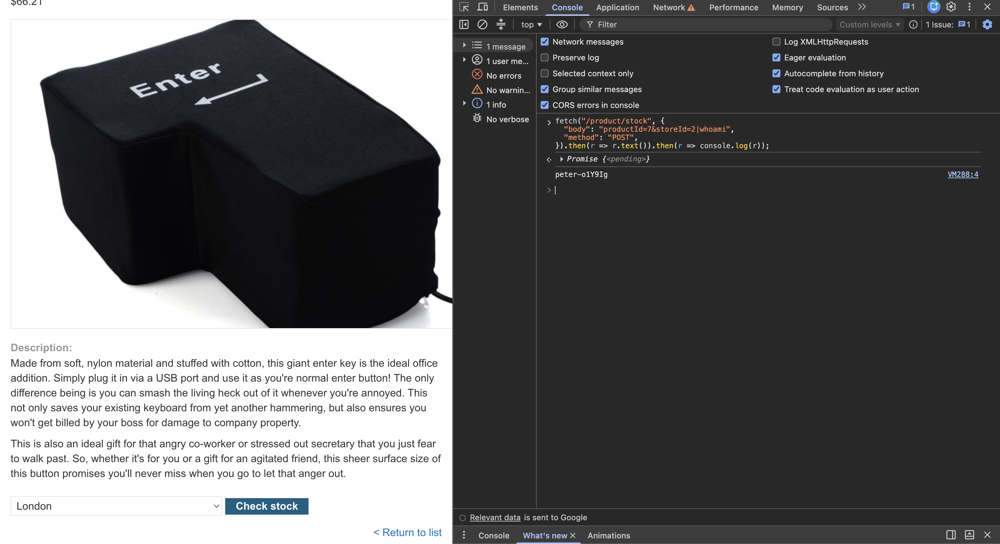

# Description

[**Lab Link**](https://portswigger.net/web-security/os-command-injection/lab-simple)

**Lab**: _OS command injection, simple case_

The application allows user to check how much stock is available for a given product for a choosen location.

However, this API endpoint being called is vulnerable to OS command injection, allowing an attacker to execute arbitrary commands on the server.

By manipulating / creating a fake request, the attacker can inject OS commands into the request and execute them on the server.

# Steps to Exploit

1. Open the lab link in a browser.
2. Go to a product page and open the browser developer tools.
3. Observe the request being made to the `/product/stock` endpoint.
4. Copy the request with preferred network call (fetch / curl / etc).
5. Modify the request body to include an OS command injection payload.

# Proof of Concept 

Type in the Browser Developer Tools:
```js
fetch("/product/stock", {
  "body": "productId=7&storeId=2|whoami",
  "method": "POST",
}).then(r => r.text()).then(r => console.log(r));
```



# Impact

- Remote Code Execution
- Data Leak
- Unauthorized Access
- Denial of Service

# Mitigation / Remediation

- Sanitize user input
- Use parameterized queries or prepared statements
- Implement proper access controls and authentication mechanisms
- Use additional security measures on the deployed server, such as firewalls and intrusion detection systems

# CVSS Justification

```
Base Score: 8.6
CVSS:3.1/AV:N/AC:L/PR:N/UI:N/S:U/C:H/I:L/A:L
```

