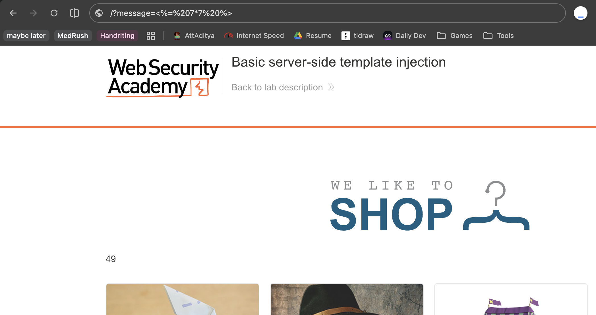

# Description

[**Lab Link**](https://portswigger.net/web-security/server-side-template-injection/exploiting/lab-server-side-template-injection-basic)

**Lab**: _Basic server-side template injection_

The application notifies the user in case the product was displayed but ran out of stock before the user could open the product page.

However, the notification is generated by by the URL query parameter, which is then passed to the server-side template engine and rendered in the response.

By manipulating the query parameter, the attacker can inject arbitrary template code into the server-side template engine, which is then executed on the server, and returned in the response.

# Steps to Exploit

1. Open the lab link in a browser.
2. Click on products until you find a product that is out of stock.
3. Check the URL query parameter and change it to inject template code.

# Proof of Concept 

Add to end of lab URL: `/?message=<%=%207*7%20%>`



# Impact

- Data Leak
- Remote Code Execution
- XSS Potential

# Mitigation / Remediation

- Sanitize user input
- Avoid using dynamic template rendering (if possible)
- Limit use of special characters in user input

# CVSS Justification

```
CVSS:3.1/AV:N/AC:L/PR:N/UI:N/S:U/C:H/I:L/A:L
```

