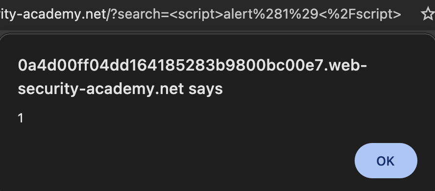

# Description

[**Lab Link**](https://portswigger.net/web-security/cross-site-scripting/reflected/lab-html-context-nothing-encoded)

**Lab**: _Reflected XSS into HTML context with nothing encoded_

The application has a search feature that allows users to search for products. When a user searches for a product, the application displays the search term in the response page.

However, the search term is used from the URL query parameter, and allows to inject arbitrary HTML code into the response page, which is then executed in the user's browser.

By manipulating the query parameter, the attacker can inject arbitrary HTML code into the response page, which is then executed in the user's browser.

# Steps to Exploit

1. Open the lab link in a browser.
2. Search with arbitrary HTML code in the search field.

# Proof of Concept 

Add to end of lab URL: `/?search=<script>alert%281%29<%2Fscript>`



# Impact

- XSS Potential
- Trojan Horse Injection
- Client Side Code Execution

# Mitigation / Remediation

- Sanitize user input
- Avoid using dynamic template rendering (if possible)
- Limit use of special characters in user input
- Use Content Security Policy (CSP) headers to restrict the execution of scripts

# CVSS Justification

```
Base Score: 5.3
CVSS:3.1/AV:N/AC:L/PR:N/UI:N/S:U/C:L/I:N/A:N
```

