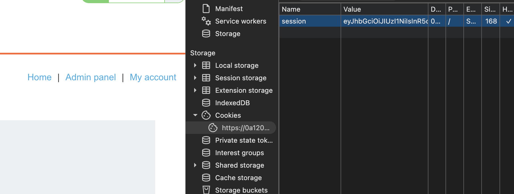

# Description

[**Lab Link**](https://portswigger.net/web-security/jwt/lab-jwt-authentication-bypass-via-unverified-signature)

**Lab**: _JWT authentication bypass via unverified signature_

The application saves login credentials in a database, and uses JWTs to authenticate users.

However, the application does not verify the signature of the JWT, which allows an attacker to bypass authentication and impersonate other users.

# Steps to Exploit

1. Open the lab link in a browser.
2. Login to the application.
3. Get the JWT from cookies.
4. Modify the JWT to impersonate another user (e.g., change the username in the payload).

# Proof of Concept 

Change session cookie: Change payload `sub` from username to "`administrator`".



# Impact

- Impersonation of users
- Unauthorized access to sensitive information
- Privilege escalation (compromised administrative accounts)

# Mitigation / Remediation

- Implement proper signature verification for JWTs.
- Use strong signing algorithms (e.g., RS256) instead of weak ones (e.g., HS256).
- Regularly rotate signing keys and implement key management practices.

# CVSS Justification

```
CVSS:3.1/AV:N/AC:L/PR:L/UI:N/S:U/C:L/I:L/A:N
```

