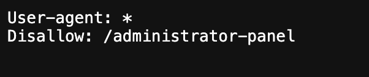

# Description

[**Lab Link**](https://portswigger.net/web-security/access-control/lab-unprotected-admin-functionality)

**Lab**: _Unprotected admin functionality_

The application has an admin panel that allows administration features.

However, the application does not properly restrict access to the admin panel.

# Steps to Exploit

1. Open the lab link in a browser.
2. Try finding the admin panel by accessing common admin URLs (e.g., `/admin`, `/administrator`, `/admin-panel`, etc.). Check the page sources and `robots.txt` file for any hints about the admin panel's location.

# Proof of Concept



# Impact

- Unauthorized access to sensitive information
- Privilege escalation (compromised administrative accounts)

# Mitigation / Remediation

- Implement proper access controls for admin functionality.
- Use strong authentication mechanisms and enforce role-based access control.
- Regularly audit and monitor access to admin panels.

# CVSS Justification

```
CVSS:3.1/AV:N/AC:L/PR:N/UI:R/S:U/C:L/I:L/A:N
```

