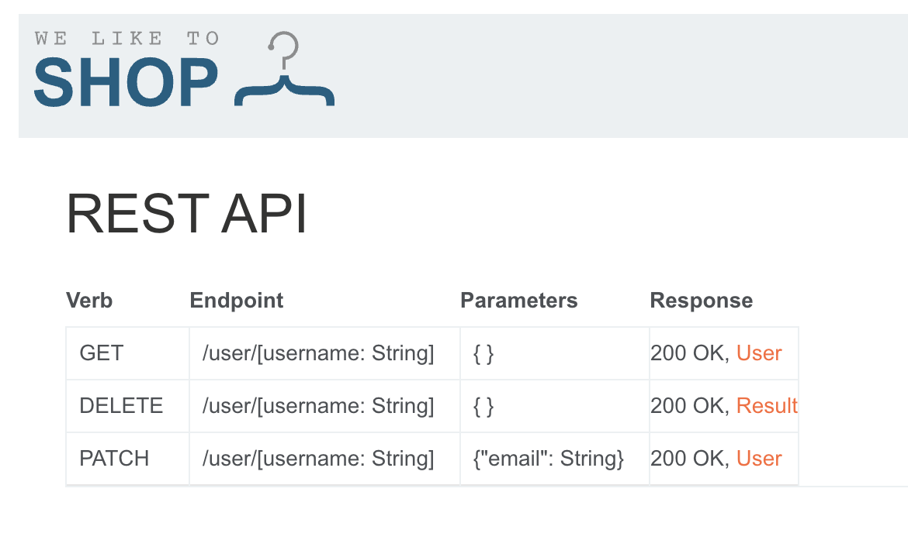

# Description

[**Lab Link**](https://portswigger.net/web-security/api-testing/lab-exploiting-api-endpoint-using-documentation)

**Lab**: _Exploiting an API endpoint using documentation_

The application has good documentation for its API endpoints which is a valuable resource for developers.

However, the documentation also provides information about an API endpoint that is not intended to be used.

These endpoints can be exploited by attackers to gain unauthorized access to sensitive information or perform actions that should not be allowed.

# Steps to Exploit

1. Open the lab link in a browser.
2. Go to `/api` for the API documentation.
3. Use the information from the documentation to craft a request.

# Proof of Concept



# Impact

- Unauthorized access to sensitive information (in case not properly secured)
- Privilege escalation (in case of admin endpoints not properly secured)

# Mitigation / Remediation

- Implement proper access controls for admin functionality.
- Only expose API endpoints that are intended for public use.
- Regularly audit API endpoints and documentation to ensure that sensitive endpoints are not exposed.
- Implement proper authentication and authorization mechanisms for all API endpoints.

# CVSS Justification

```
Base Score: 7.1
CVSS:3.1/AV:N/AC:L/PR:N/UI:R/S:U/C:L/I:H/A:N
```

