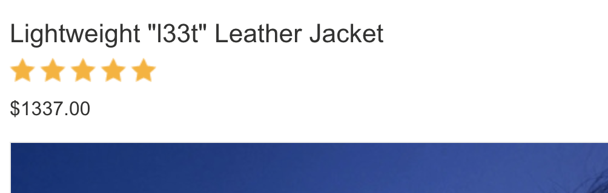
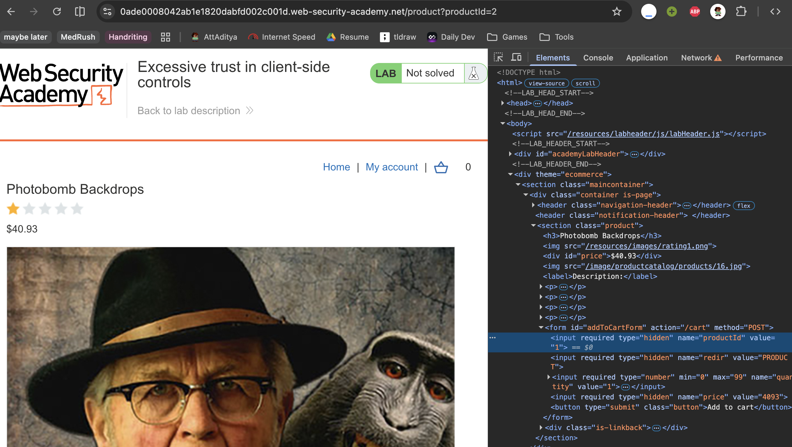
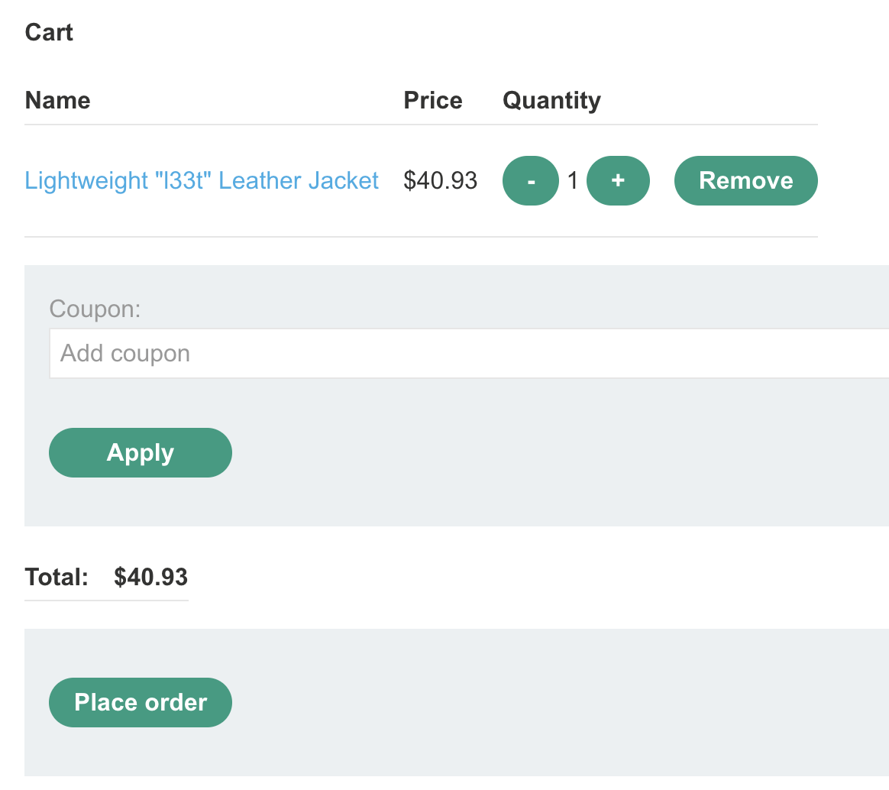

# Description

[**Lab Link**](https://portswigger.net/web-security/logic-flaws/examples/lab-logic-flaws-excessive-trust-in-client-side-controls)

**Lab**: _Excessive trust in client-side controls_

The application allows the user to select quantity of items to purchase, and user can select any quantity within the limit.

However, the limit is enforced only on the client-side, can be altered by modifying the HTML.

This allows an attacker to bypass the limit and purchase more items than allowed with lower price.

# Steps to Exploit

1. Open the lab link in a browser.
2. Decide a product to purchase and go to the product page to note the product ID.
3. Open some other product that is cheaper (or expensive if to be tested the other way) and go to the product page.
4. Use browser developer tools to modify the HTML Input value for the product ID field to the product ID of the product you want to purchase.
5. Submit the form and check the cart to see if the product has been added with the modified product ID.

# Proof of Concept





# Impact

- Unauthorized purchase of products
- Financial loss to the business
- Reputation damage due to exploitation of the vulnerability

# Mitigation / Remediation

- Implement server-side validation for all user inputs, including product IDs and quantities.
- Use secure coding practices to prevent client-side manipulation of critical data.
- Implement rate limiting and monitoring to detect and prevent abuse of the application.

# CVSS Justification

```
Base Score: 5.3
CVSS:3.1/AV:N/AC:L/PR:N/UI:N/S:U/C:N/I:L/A:N
```

