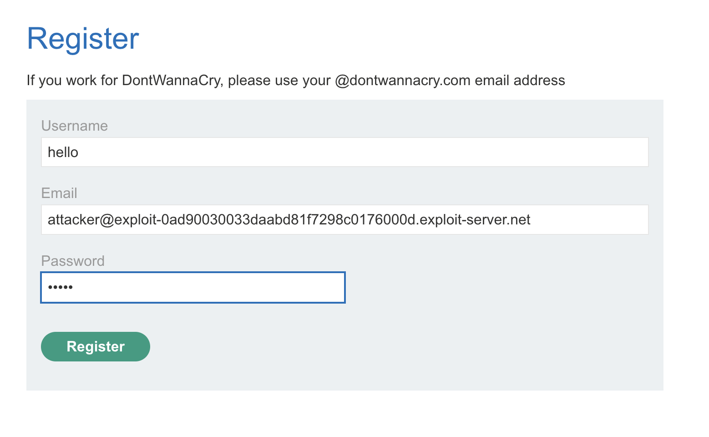
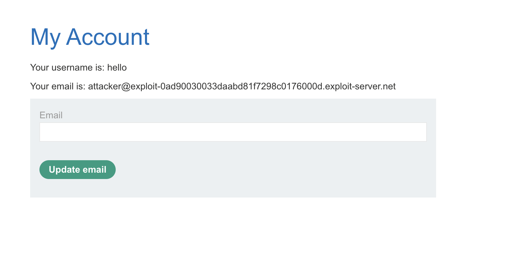
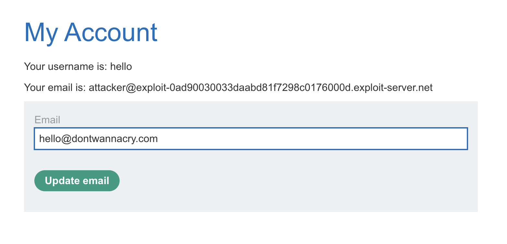
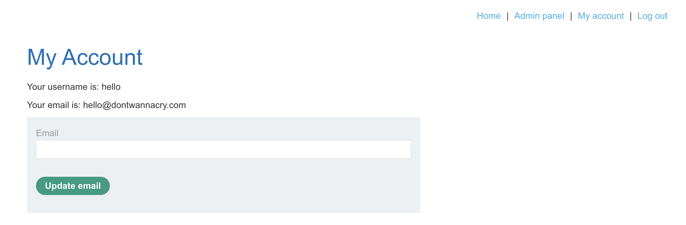
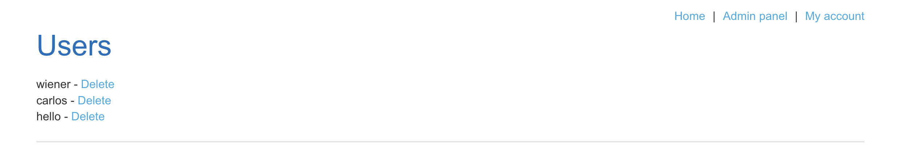

# Description

[**Lab Link**](https://portswigger.net/web-security/logic-flaws/examples/lab-logic-flaws-inconsistent-security-controls)

**Lab**: _Inconsistent security controls_

The application has a admin panel that allows administrative features. This admin panel is only accessible to company users.

The application also has an option for an user to change the email address associated with their account.

However, the application does not validate the email address change request, which allows to use the email address of other users.

An attacker can use this to change to the company email address of an administrative user, and then access the admin panel.

# Steps to Exploit

1. Open the lab link in a browser.
2. Register and verify a new account.
3. Login to the application.
4. Change the email address associated with your account to the email address of an administrative user.
5. Use the admin panel.

# Proof of Concept







# Impact

- Unauthorized access to administrative features
- Privilege escalation (compromised administrative accounts)

# Mitigation / Remediation

- Implement proper validation for email address change requests.
- Implement access controls to restrict access to administrative features to only authorized users.
- Implement logging and monitoring to detect and respond to unauthorized access attempts.

# CVSS Justification

```
CVSS:3.1/AV:N/AC:L/PR:N/UI:N/S:U/C:L/I:L/A:N
```

