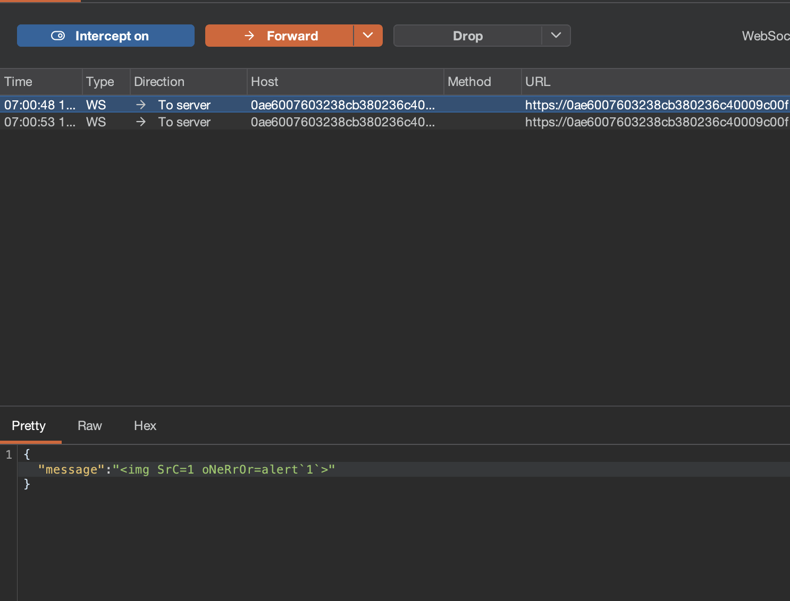
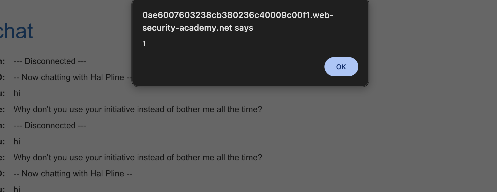

# Description

[**Lab Link**](https://portswigger.net/web-security/websockets/lab-manipulating-handshake-to-exploit-vulnerabilities)

**Lab**: _Manipulating the WebSocket handshake to exploit vulnerabilities_

The application has a live chat feature that uses WebSockets for real-time communication.

The application does validate the messages and blocks users sending messages with suspicious payloads.

However, there are obfuscation techniques that can be used to bypass the filters and inject malicious payloads.

An attacker can manipulate the messages and conduct XSS attacks.

# Steps to Exploit

1. Open the lab link in a browser.
2. Open live chat.
3. Open Burp Suite and intercept the WebSocket messages.
4. Send a message and modify the WebSocket messages to inject malicious payloads.

# Proof of Concept

Change the payload to:
```

```




# Impact

- Cross-Site Scripting (XSS) attacks
- Unauthorized access to user data
- Session hijacking
- Defacement of the application

# Mitigation / Remediation

- Implement proper input validation and sanitization for WebSocket messages.
- Use a Web Application Firewall (WAF) to detect and block malicious payloads.
- Regularly update and patch the application to fix known vulnerabilities.
- Implement Content Security Policy (CSP) to mitigate the impact of XSS attacks.

# CVSS Justification

```
Base Score: 0.0
CVSS:3.1/AV:N/AC:L/PR:N/UI:N/S:U/C:N/I:N/A:N
```

