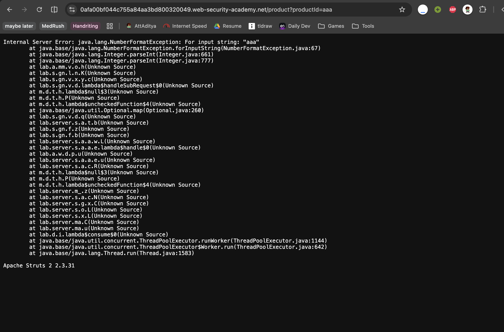

# Description

[**Lab Link**](https://portswigger.net/web-security/information-disclosure/exploiting/lab-infoleak-in-error-messages)

**Lab**: _Information disclosure in error messages_

The application uses query parameters to take requests for the product page.

However, the application does not handle edge cases properly. The errors returned by the application are sent to the client without any modification.

An attacker can know more about the application and its underlying infrastructure with this knowledge, which can be used to launch further attacks.

# Steps to Exploit

1. Open the lab link in a browser.
2. Send a request to the application with an invalid product ID that contains non-integer characters.

# Proof of Concept

Add to end of lab URL: `/product?productId=aaa`



# Impact

- Information disclosure about the application and its underlying infrastructure

# Mitigation / Remediation

- Implement proper error handling and avoid sending detailed error messages to the client.
- Log in separate servers and avoid exposing sensitive information in error messages.

# CVSS Justification

```
CVSS:3.1/AV:N/AC:L/PR:N/UI:N/S:U/C:N/I:N/A:N
```

