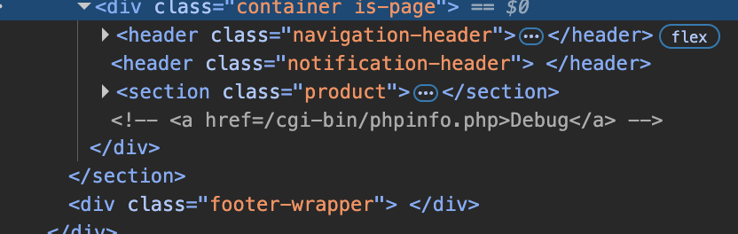
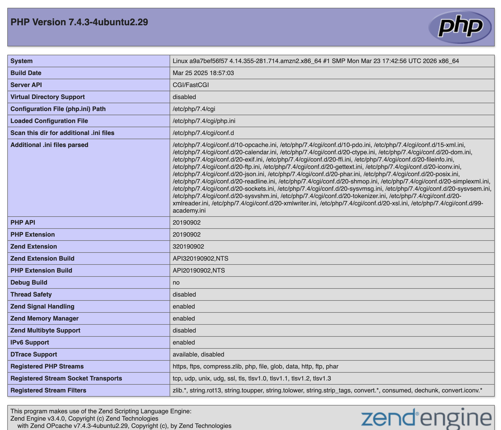

# Description

[**Lab Link**](https://portswigger.net/web-security/information-disclosure/exploiting/lab-infoleak-on-debug-page)

**Lab**: _Information disclosure on debug page_

The application has product pages.

However, the application allows to access the debug page, which may contain sensitive information about the application and its underlying infrastructure.

An attacker can know more about the application and its underlying infrastructure with this knowledge, which can be used to launch further attacks.

# Steps to Exploit

1. Open the lab link in a browser.
2. Check for pages sources to find the debug page.

# Proof of Concept




# Impact

- Information disclosure about the application and its underlying infrastructure

# Mitigation / Remediation

- Implement proper access control to restrict access to debug pages.
- Avoid exposing sensitive information in debug pages and error messages.
- Regularly review and audit the application for any information disclosure vulnerabilities.

# CVSS Justification

```
Base Score: 0.0
CVSS:3.1/AV:N/AC:L/PR:N/UI:N/S:U/C:N/I:N/A:N
```

