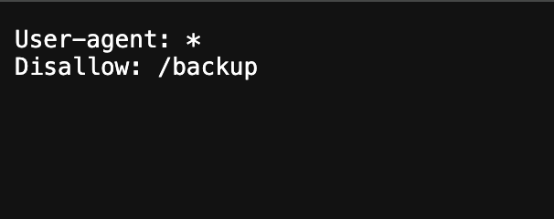
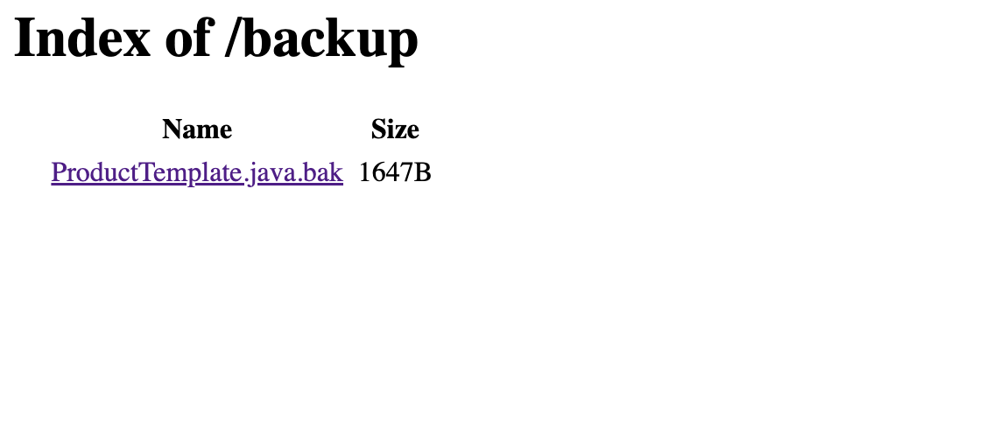
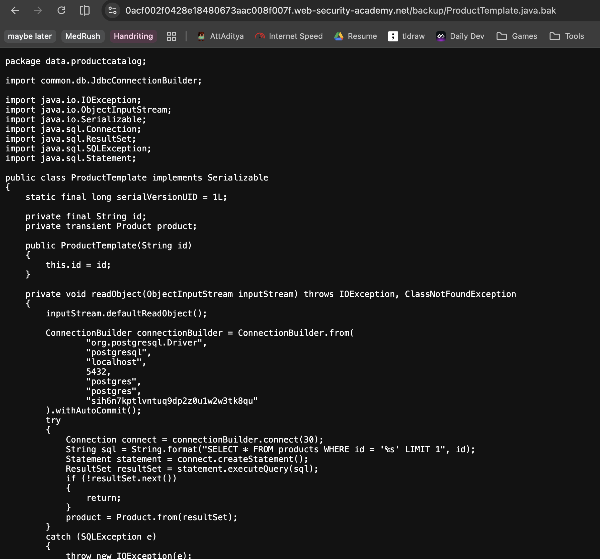

# Description

[**Lab Link**](https://portswigger.net/web-security/information-disclosure/exploiting/lab-infoleak-via-backup-files)

**Lab**: _Source code disclosure via backup files_

The application does not reveal errors and debug pages.

However, the application still has access to previous versions of the source code.

An attacker can possibly find sensitive information in the source code, such as database credentials, API keys, or other secrets.

An attacker can also use this information to find more vulnerabilities in the application.

# Steps to Exploit

1. Open the lab link in a browser.
2. Check for pages sources and `robots.txt` to find the backup files.

# Proof of Concept





# Impact

- Information disclosure about the application and its underlying infrastructure

# Mitigation / Remediation

- Implement proper access control to restrict access to sensitive files and directories.
- Regularly review and audit the application for any information disclosure vulnerabilities.

# CVSS Justification

```
CVSS:3.1/AV:N/AC:L/PR:N/UI:N/S:U/C:N/I:N/A:N
```

