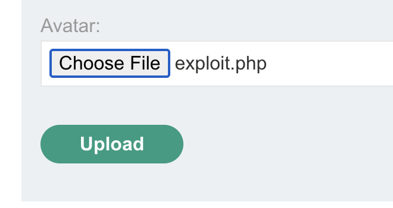
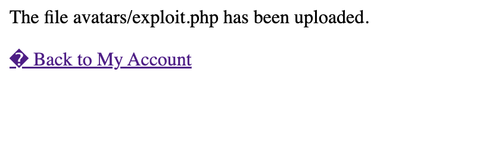
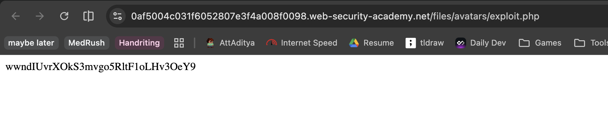

# Description

[**Lab Link**](https://portswigger.net/web-security/file-upload/lab-file-upload-remote-code-execution-via-web-shell-upload)

**Lab**: _Remote code execution via web shell upload_

The application allows users to upload profile pictures.

However, the application does not properly validate the uploaded files, which allows non image files to be uploaded.

An attacker can upload a malicious file and execute arbitrary code on the server, leading to remote code execution.

# Steps to Exploit

1. Open the lab link in a browser.
2. Login to the application.
3. Upload a any file as the profile picture.
4. Get the link to the uploaded file.
5. For PHP files the application will execute the code in the file when the link is accessed.

# Proof of Concept

Upload PHP file with the following content:

```php
<?php echo file_get_contents('/home/carlos/secret'); ?>
```





# Impact

- Remote code execution on the server
- Unauthorized access to sensitive information
- Potential compromise of the entire application and server
- Unjustified use of server resources for malicious purposes
- Unjustified use of server resources for unlimited free storage

# Mitigation / Remediation

- Implement proper file validation and sanitization for uploaded files.
- Restrict the types of files that can be uploaded (e.g., only allow image files).
- Implement proper access controls and authentication for file uploads.

# CVSS Justification

```
CVSS:3.1/AV:N/AC:L/PR:L/UI:N/S:U/C:L/I:L/A:H
```

