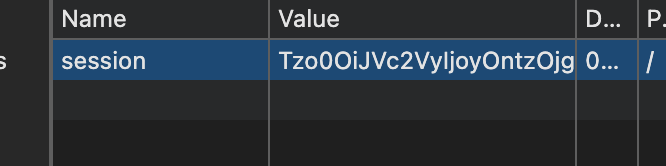
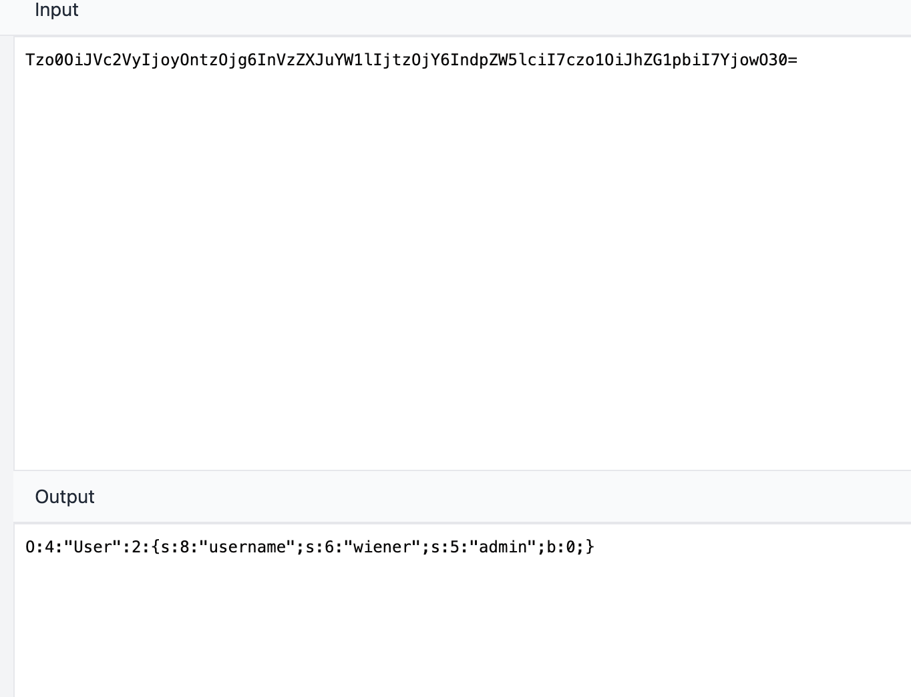
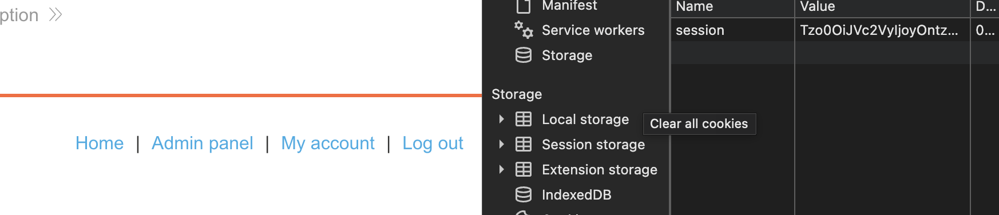

# Description

[**Lab Link**](https://portswigger.net/web-security/deserialization/exploiting/lab-deserialization-modifying-serialized-objects)

**Lab**: _Modifying serialized objects_

The application encodes the user data in a serialized format.

However, the application does not properly validate the serialized data.

An attacker can modify the serialized data to escalate privileges and access sensitive information.

# Steps to Exploit

1. Open the lab link in a browser.
2. Login to the application.
3. Modify the serialized data to escalate privileges. Serialized data is stored in Base64 format.
4. Access the modified data to retrieve sensitive information.

# Proof of Concept

Modify the serialized data to escalate privileges and become an administrator: Set the value of `b` to `1` to escalate privileges.





# Impact

- Unauthorized access to sensitive information
- Privilege escalation (compromised administrative accounts)
- Data manipulation and integrity issues
- Potential for remote code execution (depending on the deserialization mechanism and the application's implementation)

# Mitigation / Remediation

- Implement proper validation and sanitization for serialized data.
- Restrict the types of objects that can be deserialized (e.g., only allow known, safe classes).
- Implement proper access controls and authentication for operations involving serialized data.

# CVSS Justification

```
Base Score: 3.8
CVSS:3.1/AV:N/AC:H/PR:L/UI:N/S:U/C:L/I:L/A:N
```

