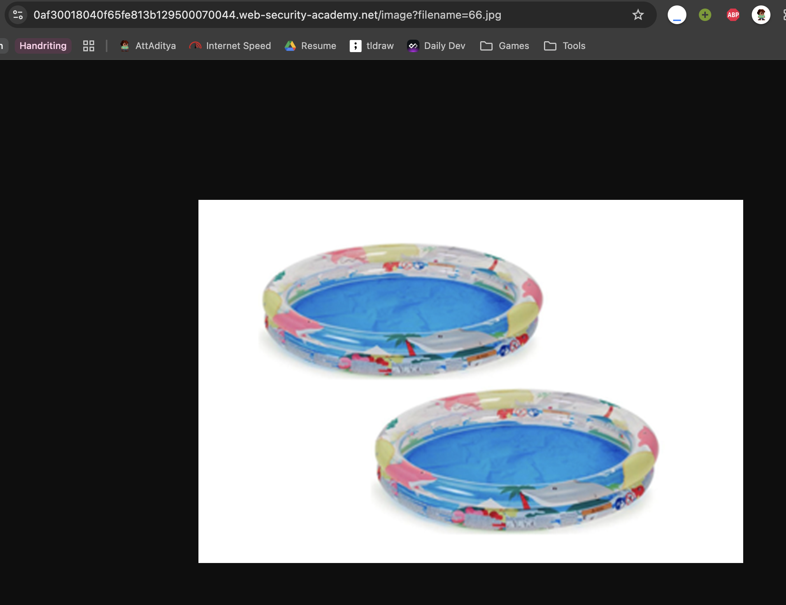
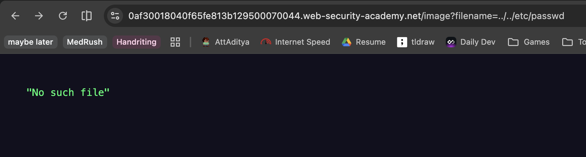
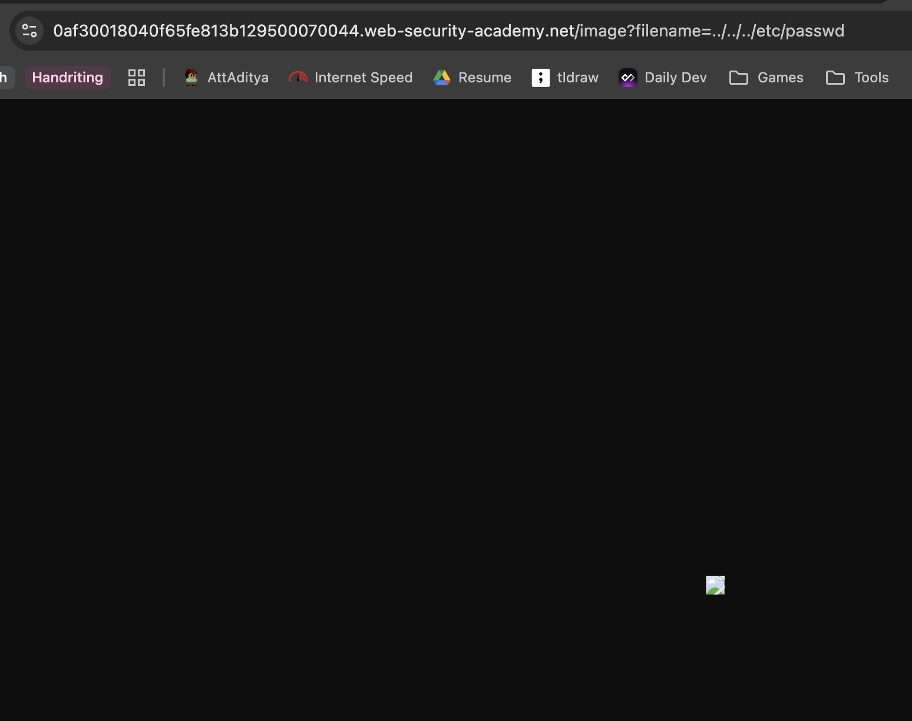

# Description

[**Lab Link**](https://portswigger.net/web-security/file-path-traversal/lab-simple)

**Lab**: _File path traversal, simple case_

The application comes along with a lot of image files.

However, the image files paths are not properly validated and access is not restricted.

An attacker can exploit this vulnerability to access sensitive files on the server.

# Steps to Exploit

1. Open the lab link in a browser.
2. View any image in a new tab and observe the URL of the image.
3. Modify the URL to traverse directories and access sensitive files.

# Proof of Concept





# Impact

- Data leakage
- Unauthorized access to sensitive information
- Potential for further exploitation

# Mitigation / Remediation

- Implement proper validation and sanitization for file paths.
- Restrict the types of files that can be accessed (e.g., only allow image files).
- Implement proper access controls and authentication for operations involving file access.

# CVSS Justification

```
CVSS:3.1/AV:N/AC:L/PR:N/UI:N/S:U/C:H/I:N/A:N
```

