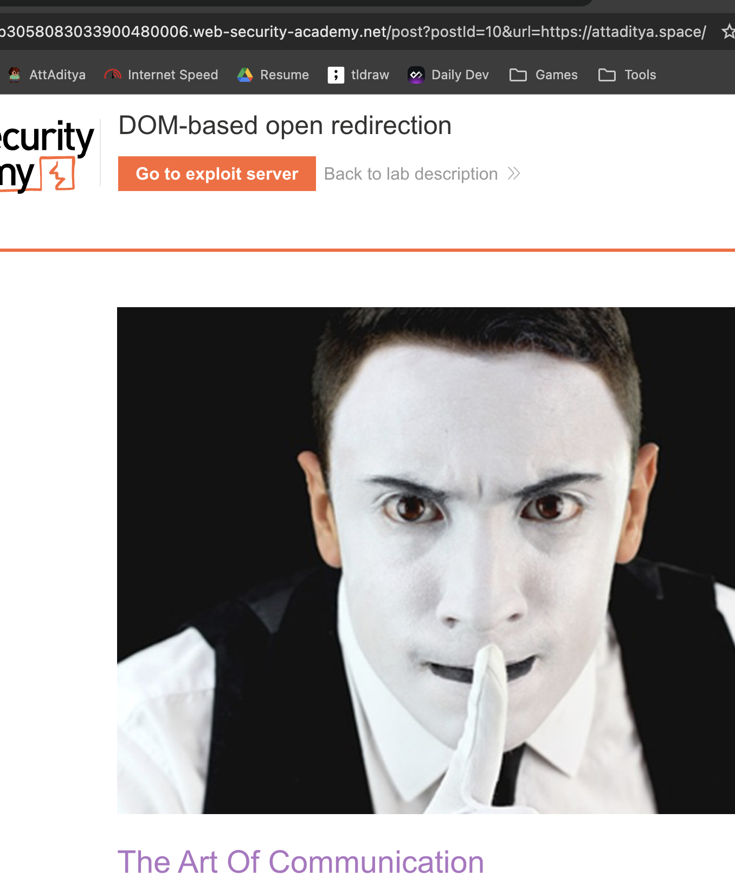
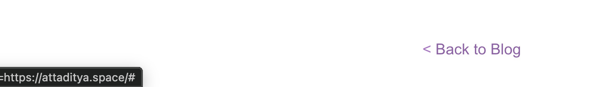

# Description

[**Lab Link**](https://portswigger.net/web-security/dom-based/open-redirection/lab-dom-open-redirection)

**Lab**: _DOM-based open redirection_

The application keeps track of user's previous routes for navigation purposes. The previous route is stored in a URL query parameter, and the application redirects the user to that route when they click on a "Go back" button.

However, the application does not properly validate the redirection URLs.

An attacker can create a malicious URL that includes a redirection to an external site, and trick users into clicking on it.

# Steps to Exploit

1. Open the lab link in a browser.
2. Create a malicious URL with a redirect parameter pointing to an external site.
3. Trick a user into clicking the malicious URL.

# Proof of Concept

Add to end of lab URL: `/post?postId=10&url=https://attaditya.space/`




# Impact

- Phishing attacks (tricking users into visiting malicious sites)
- Stealing sensitive information (e.g., login credentials, personal data)
- Spreading malware (redirecting users to sites that host malware)
- Damaging the reputation of the vulnerable application (if users associate the malicious activity with the legitimate application)
- Facilitating other attacks (e.g., redirecting users to a site that exploits browser vulnerabilities)

# Mitigation / Remediation

- Implement proper validation and sanitization for redirection URLs.
- Restrict the types of URLs that can be used for redirection (e.g., only allow internal URLs).
- Implement proper access controls and authentication for operations involving redirection.

# CVSS Justification

```
Base Score: 0.0
CVSS:3.1/AV:N/AC:L/PR:N/UI:R/S:U/C:N/I:N/A:N
```

