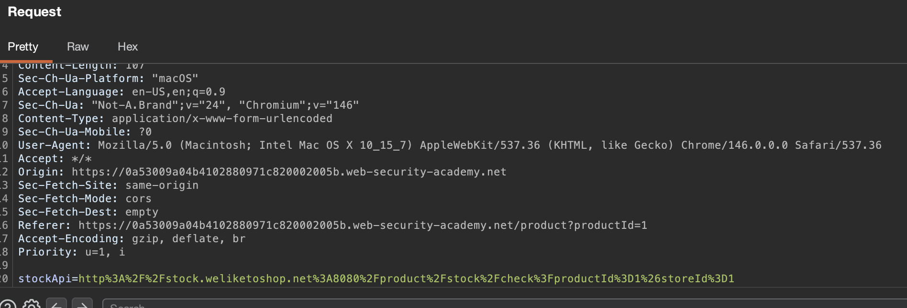
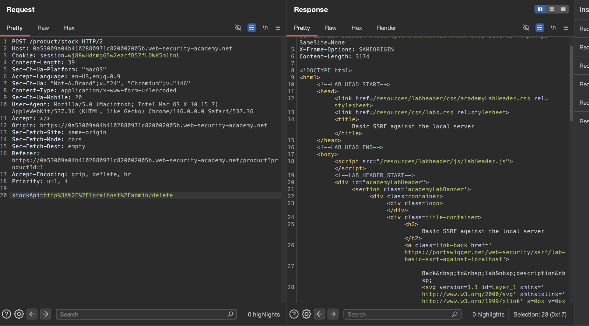

# Description

[**Lab Link**](https://portswigger.net/web-security/ssrf/lab-basic-ssrf-against-localhost)

**Lab**: _Basic SSRF against the local server_

The application allows users to check stock quantities of products by providing a product ID.

However, instead of the quantity being passed, a URL is passed to the server, which is fetched and the response is returned to the user.

An attacker can exploit this functionality to perform SSRF attacks, including accessing internal services and sensitive information.

# Steps to Exploit

1. Open the lab link in a browser.
2. Open a product page and create a request to check the stock quantity of a product.
3. Intercept the request using Burp Suite or any other proxy tool.
4. Modify the request to perform SSRF.

# Proof of Concept

Change the intercepted URL to something else like: `http://localhost/admin`




# Impact

- Access to internal services
- Exposure of sensitive information
- Potential for further attacks (e.g., exploiting internal services)

# Mitigation / Remediation

- Implement input validation to ensure that only allowed URLs can be fetched.
- Use a whitelist of allowed domains and reject requests to any other domains.
- Implement network segmentation to limit access to internal services from the application server.
- Implement proper authentication and authorization for sensitive endpoints to prevent unauthorized access.

# CVSS Justification

```
Base Score: 9.1
CVSS:3.1/AV:N/AC:L/PR:N/UI:N/S:U/C:H/I:H/A:N
```

