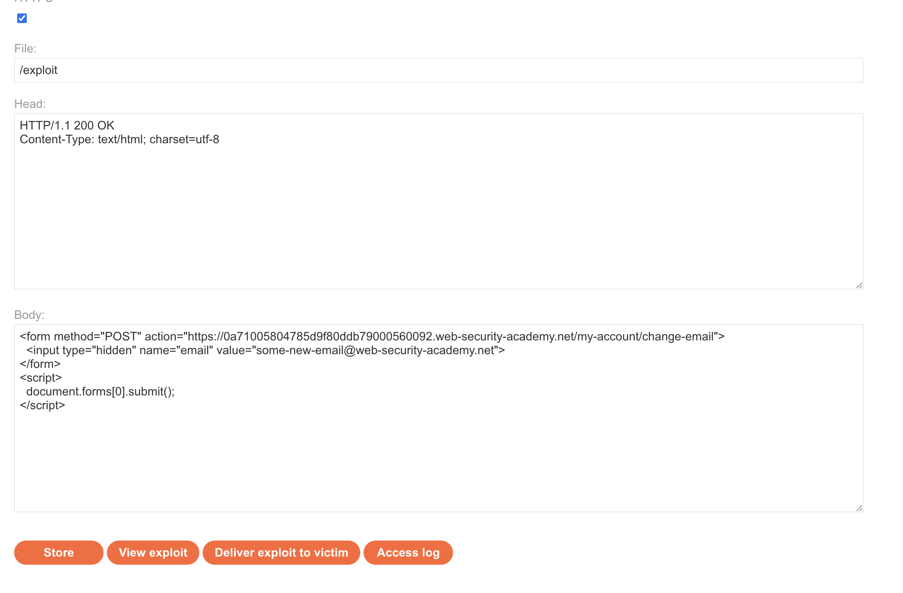
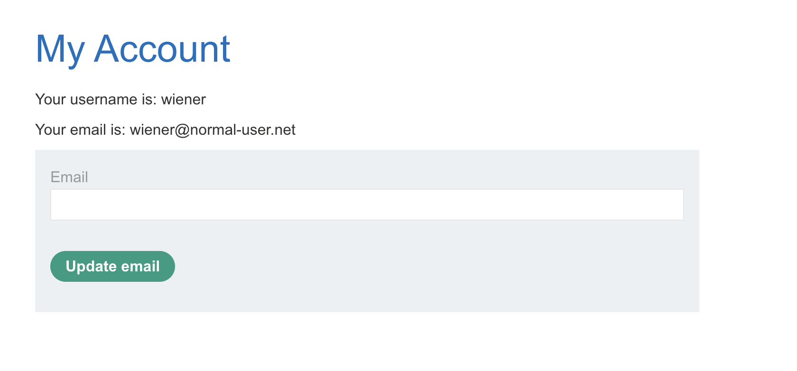
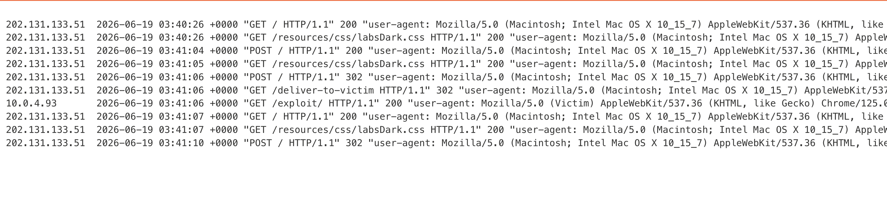
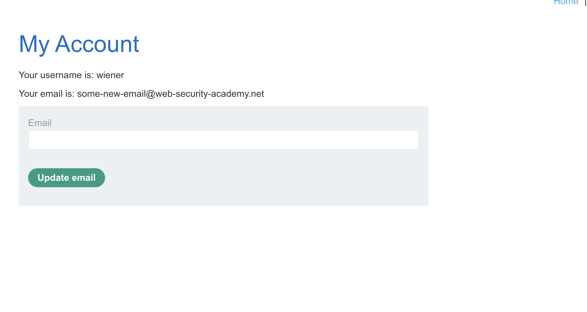

# Description

[**Lab Link**](https://portswigger.net/web-security/csrf/lab-no-defenses)

**Lab**: _CSRF vulnerability with no defenses_

The application has a functionality to change emails.

However, this functionality is not restricted to same-origin requests, and there are no CSRF defenses in place.

An attacker can exploit this functionality to perform CSRF attacks, including accessing internal services and sensitive information.

# Steps to Exploit

1. Open the lab link in a browser.
2. Login to the application.
3. Change email, and keep note of API request.
4. Deliver this request with updated email to the victim and change the email of the victim's account.

# Proof of Concept

Deliver code:
```html
<form method="POST" action="https://[LAB-URL].web-security-academy.net/my-account/change-email">
  <input type="hidden" name="email" value="anything@web-security-academy.net">
</form>
<script>
  document.forms[0].submit();
</script>
```






# Impact

- Unauthorized actions performed on behalf of the victim
- Access to internal services and sensitive information
- Potential for further exploitation, such as account takeover or data exfiltration

# Mitigation / Remediation

- Implement CSRF tokens to validate the authenticity of requests.
- Use the SameSite attribute for cookies to restrict cross-origin requests.
- Implement proper access controls and authentication mechanisms for sensitive actions.
- Educate users about the risks of CSRF attacks and encourage them to be cautious when clicking on links or submitting forms from untrusted sources.

# CVSS Justification

```
Base Score: 5.3
CVSS:3.1/AV:N/AC:L/PR:N/UI:N/S:U/C:L/I:N/A:N
```

