# **`[Source Code Review]`** Scaler Support Desk

## Submission Details

- **Name**: Aditya Prasad Dash
- **Roll Number**: 23BCS10138
- **Batch**: Batch of 2027
- **Email**: [aditya.23bcs10138@sst.scaler.com](mailto:aditya.23bcs10138@sst.scaler.com)

## Tools

- **Code Editor**: Visual Studio Code
- **Version Control**: Git
- **Python Version**: 3.12
- **Pip Version**: 23.2.1
- **Static Analysis Tool**:
  - [Semgrep](https://semgrep.dev/): 1.167.0

# Findings

**Saved Scan Log**: [`scan.log`](./scan.log)

## Hardcoded Secret

### Classification

_**True Positive**_

### Justification

Hardcoded secret is visible in the source code.

### Context

Field                   | Details
------------------------|---------
File Name               | `app.py`
Function Name           | `[GLOBAL SCOPE]`
Vulnerable Line Numbers | 20 - 20

### Code Screenshot

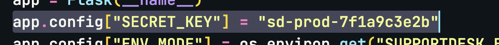

### Why is it a Vulnerability?

The code contains hardcoded secret for the Flask application, which is a security risk in case there is a source code leak, assuming there is no version control system in place, or if there is then it is private.

Additionally, the production value should never be hardcoded in the source code, and should be rotated regularly to avoid any security risks.

### Security Impact

- Information Disclosure

### Recommended Remediation

- Remove the hardcoded secret from the source code.
- Use environment variables or a secure vault to store secrets.

## Usage of `eval`

### Classification

_**True Positive**_

### Justification

The `eval` function is present in code without any input validation or sanitization.

### Context

Field                   | Details
------------------------|---------
File Name               | `app.py`
Function Name           | `sla_score`
Vulnerable Line Numbers | 162 - 167

### Code Screenshot

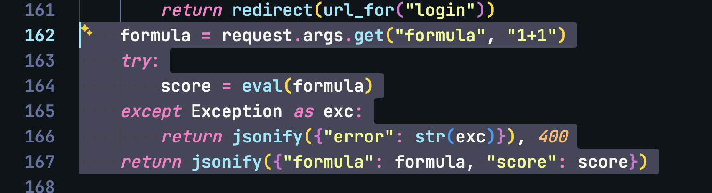

### Why is it a Vulnerability?

The code uses the `eval` function directly with a try-except block without any input validation or sanitization.

While any trials for causing errors are blocked, if the API is used directly via a logged in user, code can still be executed, and results can also be sent because the error caught is sent to user, additionally successful execution results are also sent to the user.

Additionally, with helps of generators, there is possibility that user can run a code that can run indefinitely, and if the server is not configured properly, the thread might not stop, which results in consistent CPU usage, and possible denial of service.

### Security Impact

- Information Disclosure
- Remote Code Execution
- Denial of Service

### Recommended Remediation

- Avoid using `eval` function, and use safer alternatives like `ast.literal_eval` or other parsing methods.
- Implement input validation and sanitization to ensure that only expected inputs are processed.
- Implement proper error handling to avoid exposing sensitive information to users.
- Implement rate limiting and resource usage monitoring to prevent denial of service attacks.

## Dangerous System Call

### Classification

_**True Positive**_

### Justification

There is a system call being done with params passed from request.

### Context

Field                   | Details
------------------------|---------
File Name               | `app.py`
Function Name           | `ping`
Vulnerable Line Numbers | 191 - 191

### Code Screenshot

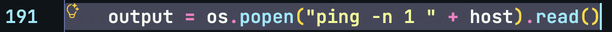

### Why is it a Vulnerability?

There is an `os.popen` call being made with params passed from request, the params are not sanitized, and the output of the command is sent to the user.

This allows possibility of command injection, where an attacker can execute arbitrary commands on the server, leading to potential compromise of the system.

### Security Impact

- Remote Code Execution 

### Recommended Remediation

- Avoid using `os.popen` with unsanitized user input.
- Implement input validation and sanitization to ensure that only expected inputs are processed.
- Use safer alternatives like `subprocess.run` with a list of arguments instead of a single string.

## Returned Formatted String Directly

### Classification

_**False Positive**_

### Justification

Assuming the dangerous system call is fixed, the returned formatted string is not a vulnerability.

### Context

Field                   | Details
------------------------|---------
File Name               | `app.py`
Function Name           | `ping`
Vulnerable Line Numbers | 192 - 192

### Code Screenshot

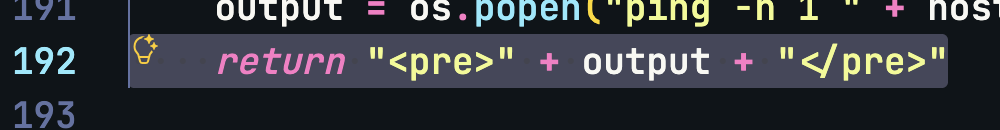

## Dangerous System Call

### Classification

_**False Positive**_

### Justification

There is a system call being done with params passed from request, however it is properly sanitized and validated.

### Context

Field                   | Details
------------------------|---------
File Name               | `app.py`
Function Name           | `ping_internal`
Vulnerable Line Numbers | 201 - 203

### Code Screenshot

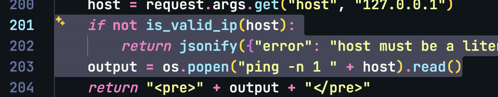

## Returned Formatted String Directly

### Classification

_**False Positive**_

### Justification

The output of the command is being returned to the user, however it is properly sanitized and validated.

### Context

Field                   | Details
------------------------|---------
File Name               | `app.py`
Function Name           | `ping_internal`
Vulnerable Line Numbers | 204 - 204

### Code Screenshot

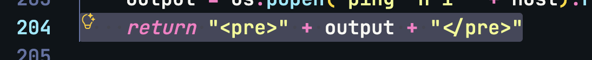

## Exposed Host IP

### Classification

_**False Positive**_

### Justification

The `app.run` is being called with `host` parameter, however it is set to `0.0.0.0`, which is not the real host IP.

### Context

Field                   | Details
------------------------|---------
File Name               | `app.py`
Function Name           | `[GLOBAL SCOPE]`
Vulnerable Line Numbers | 220 - 220

### Code Screenshot

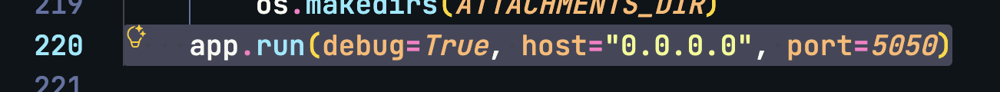

## Debug Mode Enabled

### Classification

_**True Positive**_

### Justification

The `app.run` is being called with `debug=True`, which enables debug mode.

### Context

Field                   | Details
------------------------|---------
File Name               | `app.py`
Function Name           | `[GLOBAL SCOPE]`
Vulnerable Line Numbers | 220 - 220

### Code Screenshot

### Why is it a Vulnerability?

The `app.run` is being called with `debug=True`, which enables debug mode.

This allows use of WSGI debugger and web-based interactive debugger, which can be exploited by an attacker to execute arbitrary code on the server via triggering an exception and accessing the debugger.

### Security Impact

- Remote Code Execution
- Information Disclosure

### Recommended Remediation

- Disable debug mode in production by setting `debug=False` or removing the `debug` parameter altogether.

## Exposed Port

### Classification

_**True Positive**_

### Justification

The `app.run` is being called with `port` parameter, which exposes the application on a specific port.

### Context

Field                   | Details
------------------------|---------
File Name               | `app.py`
Function Name           | `[GLOBAL SCOPE]`
Vulnerable Line Numbers | 220 - 220

### Code Screenshot

### Why is it a Vulnerability?

The `app.run` is being called with `port` parameter, which exposes the application on a specific port. With source code leakage possibility, this makes SSRF attacks possible if the application is exposed to the internet and calls are being made to internal services.

### Security Impact

- Server-Side Request Forgery (SSRF)
- Information Disclosure

### Recommended Remediation

- Avoid exposing the application on a specific port in production.
- Use environment variables or configuration files to set the port dynamically.
- Use a reverse proxy like Nginx or Apache to handle incoming requests and forward them to the Flask application on a different port.

## Raw SQL Execution

### Classification

_**True Positive**_

### Justification

The code executes raw SQL queries with user input without any sanitization or parameterization.

### Context

Field                   | Details
------------------------|---------
File Name               | `model.py`
Function Name           | `search_tickets`
Vulnerable Line Numbers | 117 - 120

### Code Screenshot

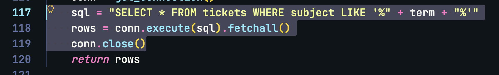

> Additionally, used without any sanitization or parameterization in `search` function in `app.py:77`
  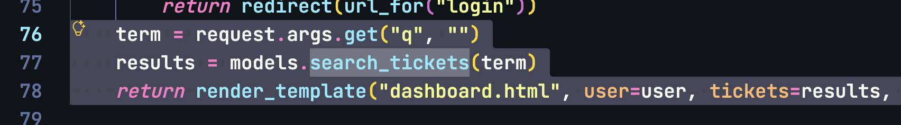

### Why is it a Vulnerability?

The code executes raw SQL queries with user input without any sanitization or parameterization. This makes the application vulnerable to SQL injection attacks, where an attacker can manipulate the SQL query to access or modify sensitive data.

### Security Impact

- SQL Injection

### Recommended Remediation

- Use parameterized queries or an ORM to prevent SQL injection.
- Validate and sanitize all user inputs before using them in SQL queries.
- Implement proper error handling to avoid exposing sensitive information.

## Raw SQL Execution

### Classification

_**False Positive**_

### Justification

The code executes raw SQL queries with user input, however the column is searched, sanitized and validated prior to execution, and the query is parameterized.

### Context

Field                   | Details
------------------------|---------
File Name               | `model.py`
Function Name           | `tickets_by_status`
Vulnerable Line Numbers | 131 - 137

### Code Screenshot

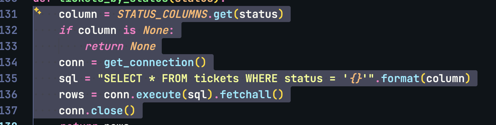

## Insecure Hashing Algorithm

### Classification

_**True Positive**_

### Justification

The code uses MD5 hashing algorithm, which is insecure and vulnerable.

### Context

Field                   | Details
------------------------|---------
File Name               | `model.py`
Function Name           | `hash_password`
Vulnerable Line Numbers | 7 - 7

### Code Screenshot

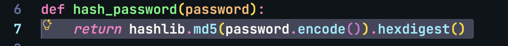

### Why is it a Vulnerability?

The code uses MD5 hashing algorithm, which is insecure and vulnerable to collision attacks.

### Security Impact

- Insecure Hashing

### Recommended Remediation

- Use a secure hashing algorithm like `bcrypt` or `scrypt`.
- Implement proper salting to prevent rainbow table attacks.
- Ensure the hashing function is used correctly and consistently throughout the application.

## Missing CSRF Token in Template Form

### Classification

_**True Positive**_

### Justification

Template forms are missing CSRF tokens.

### Context

Field                   | Details
------------------------|---------
File Name               | `templates/login.html`
Function Name           |
Vulnerable Line Numbers | 8 - 18

### Code Screenshot

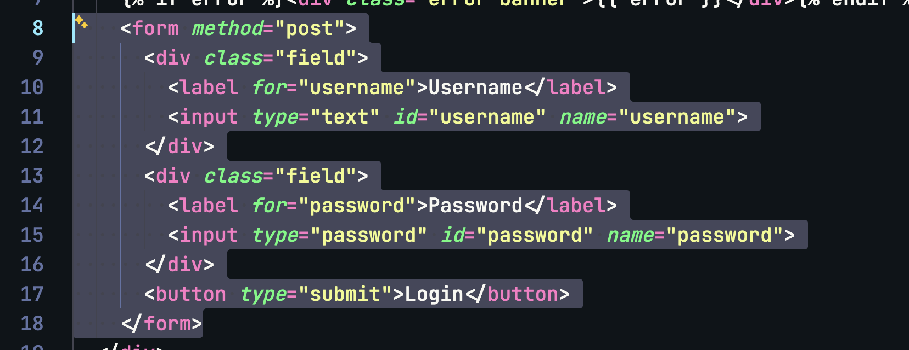

### Why is it a Vulnerability?

The template forms are missing CSRF tokens, which makes the application vulnerable to Cross-Site Request Forgery (CSRF) attacks. An attacker can trick a user into submitting a malicious request on their behalf, potentially leading to unauthorized actions being performed.

### Security Impact

- Cross-Site Request Forgery (CSRF)

### Recommended Remediation

- Implement CSRF protection in the application by using CSRF tokens in forms.

## Missing CSRF Token in Template Form

### Classification

_**True Positive**_

### Justification

Template forms are missing CSRF tokens.

### Context

Field                   | Details
------------------------|---------
File Name               | `templates/ticket.html`
Function Name           |
Vulnerable Line Numbers | 14 - 17

### Code Screenshot

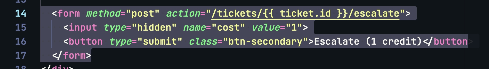

### Why is it a Vulnerability?

The template forms are missing CSRF tokens, which makes the application vulnerable to Cross-Site Request Forgery (CSRF) attacks. An attacker can trick a user into submitting a malicious request on their behalf, potentially leading to unauthorized actions being performed.

### Security Impact

- Cross-Site Request Forgery (CSRF)

### Recommended Remediation

- Implement CSRF protection in the application by using CSRF tokens in forms.

## Missing CSRF Token in Template Form

### Classification

_**True Positive**_

### Justification

Template forms are missing CSRF tokens.

### Context

Field                   | Details
------------------------|---------
File Name               | `templates/ticket.html`
Function Name           |
Vulnerable Line Numbers | 25 - 28

### Code Screenshot

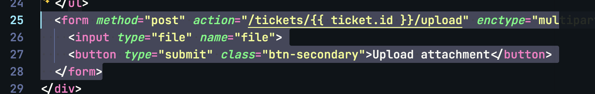

### Why is it a Vulnerability?

The template forms are missing CSRF tokens, which makes the application vulnerable to Cross-Site Request Forgery (CSRF) attacks. An attacker can trick a user into submitting a malicious request on their behalf, potentially leading to unauthorized actions being performed.

### Security Impact

- Cross-Site Request Forgery (CSRF)

### Recommended Remediation

- Implement CSRF protection in the application by using CSRF tokens in forms.

## Missing CSRF Token in Template Form

### Classification

_**True Positive**_

### Justification

Template forms are missing CSRF tokens.

### Context

Field                   | Details
------------------------|---------
File Name               | `templates/ticket.html`
Function Name           |
Vulnerable Line Numbers | 39 - 44

### Code Screenshot

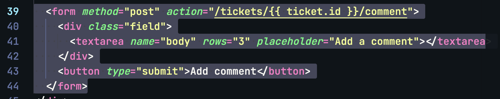

### Why is it a Vulnerability?

The template forms are missing CSRF tokens, which makes the application vulnerable to Cross-Site Request Forgery (CSRF) attacks. An attacker can trick a user into submitting a malicious request on their behalf, potentially leading to unauthorized actions being performed.

### Security Impact

- Cross-Site Request Forgery (CSRF)

### Recommended Remediation

- Implement CSRF protection in the application by using CSRF tokens in forms.

